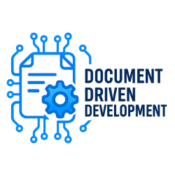

# Document Driven Development Kit



## Welcome to the Future of Development 🚀

The Document Driven Development Kit (DDDK) is here to revolutionize the way you build software! Say goodbye to chaotic workflows and hello to a streamlined, documentation-first approach that keeps your team aligned and your projects on track.

[GitHub](https://github.com/Coderrob/ddd-kit)

---

## Why You'll Love DDDK ❤️

- **Modern features for documentation-driven development**: Templates, CLI tools, and automation to make your life easier.
- **Always connected**: Keep your documentation and development in perfect harmony.
- **Cross-platform**: Whether you're on Windows, macOS, or Linux, we've got you covered.
- **Responsive interface**: Designed to look and feel amazing on any device.
- **Synchronized experience**: Pick up right where you left off, no matter where you are.

To dive deeper into the magic of DDDK, check out our [non-existent documentation that is still, ironically, being documented].

---

## Get Started in Minutes ⏱️

### Running Stable Releases

Clone the repository and install dependencies:

```bash
git clone https://github.com/Coderrob/ddd-kit.git
cd document-driven-development
npm install
```

Run the toolkit:

```bash
npm start
```

### Running from Source

Want to live on the edge? Run the latest codebase:

```bash
git clone https://github.com/Coderrob/ddd-kit.git
cd document-driven-development
npm install
npm run build
npm start
```

⚠️ **Note**: The development version is cutting-edge but may not be production-ready. Use at your own risk!

---

## Development Setup 🛠️

Follow the instructions above to run the toolkit from source. Before contributing, make sure to:

- Read the [Contributing Guide](CONTRIBUTING.md).
- Run `npm test` to ensure your changes meet our quality standards.
- Use `npm run dev` for hot module reloading during development.

To avoid committing files that fail linting, install a pre-commit git hook:

```bash
npm run githooks-install
```

---

## Command Line Interface (CLI) ⚡

The Document Driven Development Kit comes with a powerful CLI to supercharge your workflow. Here's what you can do:

### `cli`

The `cli` command is your gateway to creating and managing specifications.

#### Usage

```bash
npm run cli -- <command> [options]
```

#### Commands

- `init`: Kickstart a new specification project.

  Example:

  ```bash
  npm run cli -- init my-project
  ```

- `plan`: Turn your specification into a technical implementation plan.

  Example:

  ```bash
  npm run cli -- plan my-spec.md
  ```

- `tasks`: Break down your specification into actionable tasks.

  Example:

  ```bash
  npm run cli -- tasks my-spec.md
  ```

### CLI Commands and Sub-Commands

The Document Driven Development Kit CLI provides the following commands and sub-commands:

#### `todo:list`

List all tasks in the TODO.md file.

Example:

```bash
npm run cli -- todo:list
```

#### `todo:show`

Show details of a specific task by ID.

Example:

```bash
npm run cli -- todo:show --id <task-id>
```

#### `todo:complete`

Mark a task as complete.

Example:

```bash
npm run cli -- todo:complete --id <task-id> --message "Task completed"
```

#### `todo:add`

Add a new task from a file.

Example:

```bash
npm run cli -- todo:add --file <file-path>
```

#### `todo:validate`

Validate tasks against the schema.

Example:

```bash
npm run cli -- todo:validate
```

#### `todo:validate:fix`

Validate tasks and optionally fix issues.

Example:

```bash
npm run cli -- todo:validate:fix --fix --dryRun --summary json
```

#### Options

- `--debug`: Get detailed debug output for troubleshooting.

  Example:

  ```bash
  npm run cli -- plan my-spec.md --debug
  ```

- `--no-git`: Skip git repository initialization during `init`.

  Example:

  ```bash
  npm run cli -- init my-project --no-git
  ```

For a full list of commands and options, run:

```bash
npm run cli -- --help
```

---

## Additional Links 🔗

- [Code](https://github.com/Coderrob/ddd-kit)
- [Issues](https://github.com/Coderrob/ddd-kit/issues)
- [Pull Requests](https://github.com/Coderrob/ddd-kit/pulls)

---

## License 📜

This project is licensed under the terms of the MIT open source license. See the [LICENSE](LICENSE) file for details.
