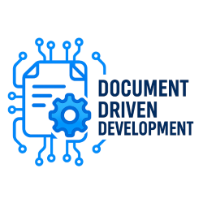

# Document Driven Development Kit



## Welcome to the Future of Development 🚀

The Document Driven Development Kit (DDDK) is here to revolutionize the way you build software! Say goodbye to chaotic workflows and hello to a streamlined, documentation-first approach that keeps your team aligned and your projects on track.

[GitHub](https://github.com/Coderrob/ddd-kit)

---

## Why You'll Love DDDK ❤️

- **Modern features for documentation-driven development**: Templates, CLI tools, and automation to make your life easier.
- **Always connected**: Keep your documentation and development in perfect harmony.
- **Cross-platform**: Whether you're on Windows, macOS, or Linux, we've got you covered.
- **Responsive interface**: Designed to look and feel amazing on any device.
- **Synchronized experience**: Pick up right where you left off, no matter where you are.

To dive deeper into the magic of DDDK, check out our [non-existent documentation that is still, ironically, being documented].

---

## Get Started in Minutes ⏱️

### Running Stable Releases

Clone the repository and install dependencies:

```bash
git clone https://github.com/Coderrob/ddd-kit.git
cd ddd-kit
npm install
npm run build
```

Run the CLI:

```bash
npm run cli -- --help
```

### Running from Source

Want to live on the edge? Run the latest codebase:

```bash
git clone https://github.com/Coderrob/ddd-kit.git
cd ddd-kit
npm install
npm run build
npm run cli -- --help
```

⚠️ **Note**: The development version is cutting-edge but may not be production-ready. Use at your own risk!

---

## Development Setup 🛠️

Follow the instructions above to run the toolkit from source. Before contributing, make sure to:

- Run `npm test` to ensure your changes meet our quality standards.
- Use `npm run dev` for development with TypeScript compilation.
- Use `npm run build` to compile TypeScript to JavaScript.

To avoid committing files that fail linting, git hooks are automatically installed:

```bash
npm install  # Installs husky pre-commit hooks automatically
```

---

## Command Line Interface (CLI) ⚡

The Document Driven Development Kit comes with a powerful CLI (`dddctl`) to supercharge your workflow. Here's what you can do:

### CLI Usage

The CLI provides task management, validation, and development workflow commands.

#### Usage

```bash
npm run cli -- <command> [options]
```

Or if installed globally:

```bash
dddctl <command> [options]
```

#### Commands

- `next`: Hydrate the next eligible task for processing.

  Example:

  ```bash
  npm run cli -- next
  ```

- `render`: Re-render guidance for a specific task.

  Example:

  ```bash
  npm run cli -- render <task-id>
  ```

- `supersede`: Supersede an old UID with a new one.

  Example:

  ```bash
  npm run cli -- supersede <old-uid> <new-uid>
  ```

### CLI Commands and Sub-Commands

The Document Driven Development Kit CLI provides the following commands and sub-commands:

#### `todo list`

List all tasks in the TODO.md file.

Example:

```bash
npm run cli -- todo list
```

#### `todo show`

Show details of a specific task by ID.

Example:

```bash
npm run cli -- todo show <task-id>
```

#### `todo complete`

Mark a task as complete.

Example:

```bash
npm run cli -- todo complete <task-id>
```

#### `todo add`

Add a new task from a file.

Example:

```bash
npm run cli -- todo add <file-path>
```

#### `validate tasks`

Validate all tasks against the schema.

Example:

```bash
npm run cli -- validate tasks
```

#### `validate fix`

Validate tasks and optionally fix issues.

Example:

```bash
npm run cli -- validate fix
```

#### `ref audit`

Audit references across repository and tasks.

Example:

```bash
npm run cli -- ref audit
```

#### Options

- `-V, --version`: Display the version number.

  Example:

  ```bash
  npm run cli -- --version
  ```

- `-h, --help`: Display help information for any command.

  Example:

  ```bash
  npm run cli -- todo --help
  ```

For a full list of commands and options, run:

```bash
npm run cli -- --help
```

---

## Development Scripts 🛠️

The project includes several npm scripts for development and validation:

### Task Validation

- **Quick Validation**: Use the lightweight validation script for faster feedback:

  ```bash
  npm run validate-local
  ```

  This provides the same validation as `npm run cli -- validate tasks` but with simpler output and faster execution.

### Code Quality

- **Linting**: Check and fix code style issues:

  ```bash
  npm run lint        # Check for issues
  npm run lint:fix    # Fix issues automatically
  ```

- **Formatting**: Format code with Prettier:

  ```bash
  npm run format      # Format all files
  npm run format:check # Check formatting
  ```

- **Build**: Compile TypeScript to JavaScript:

  ```bash
  npm run build
  ```

- **Development**: Run CLI directly from TypeScript source:

  ```bash
  npm run dev        # Equivalent to ts-node src/cli.ts
  ```

- **Testing**: Run the test suite:

  ```bash
  npm test
  ```

---

## Additional Links 🔗

- [Code](https://github.com/Coderrob/ddd-kit)
- [Issues](https://github.com/Coderrob/ddd-kit/issues)
- [Pull Requests](https://github.com/Coderrob/ddd-kit/pulls)

---

## License 📜

This project is licensed under the terms of the GPL v3 open source license. See the [LICENSE](LICENSE) file for details.
