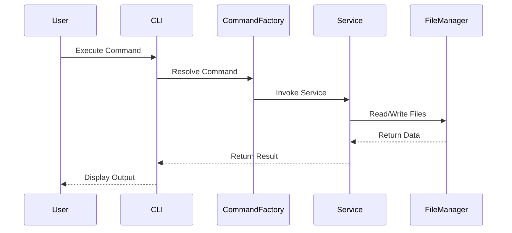

# DDD-Kit CLI Documentation

## Overview

The DDD-Kit CLI is a command-line tool designed to manage tasks, validate documentation, and streamline workflows in a documentation-first development process. It provides commands for task management, validation, rendering, and auditing.

---

## Commands

### Task Management

#### `list`

- **Description**: Lists all tasks from the `TODO.md` file.

- **Usage**: `ddd-kit list`

- **Details**: Displays tasks with their ID, priority, and summary.

#### `add`

- **Description**: Adds a new task to the `TODO.md` file.

- **Usage**: `ddd-kit add <task-file>`

- **Details**: Reads a task from the specified file and appends it to the task list.

#### `complete`

- **Description**: Marks a task as complete and moves it to the `CHANGELOG.md` file.

- **Usage**: `ddd-kit complete <task-id>`

- **Details**: Updates the task status and appends it to the changelog.

#### `show`

- **Description**: Displays details of a specific task.

- **Usage**: `ddd-kit show <task-id>`

- **Details**: Shows the full details of the task, including its description and metadata.

---

### Validation

#### `validate`

- **Description**: Validates all tasks in the `TODO.md` file against the JSON schema.

- **Usage**: `ddd-kit validate`

- **Details**: Reports validation errors and ensures tasks conform to the schema.

#### `validate-and-fix`

- **Description**: Validates and applies fixes to tasks in the `TODO.md` file.

- **Usage**: `ddd-kit validate-and-fix`

- **Details**: Automatically resolves common issues and updates the task list.

---

### Rendering

#### `render`

- **Description**: Renders tasks or documentation to a specified format.

- **Usage**: `ddd-kit render <format>`

- **Details**: Supports formats like HTML, Markdown, and JSON.

#### `next`

- **Description**: Displays the next task in the queue.

- **Usage**: `ddd-kit next`

- **Details**: Identifies the highest-priority task.

---

### Auditing

#### `ref-audit`

- **Description**: Audits references in the documentation.

- **Usage**: `ddd-kit ref-audit`

- **Details**: Ensures all references are valid and up-to-date.

#### `supersede`

- **Description**: Marks a task as superseded by another.

- **Usage**: `ddd-kit supersede <task-id> <new-task-id>`

- **Details**: Updates the task status and links it to the new task.

---

## Architecture

### System Architecture

The DDD-Kit CLI is built on a modular architecture with the following key components:

- **Commands**: Encapsulate individual CLI functionalities.

- **Core**: Provides shared utilities and services.

- **Validators**: Ensure data integrity and schema compliance.

- **Renderers**: Handle output formatting and presentation.

- **Storage**: Manages task and changelog files.

### Sequence Diagram

Below is a high-level sequence diagram illustrating the flow of a typical command execution:

---

## Additional Notes

- Ensure `TODO.md` and `CHANGELOG.md` are present in the root directory.

- Use the `--help` flag with any command to view detailed usage instructions.

---

For more information, refer to the [README.md](../README.md).
