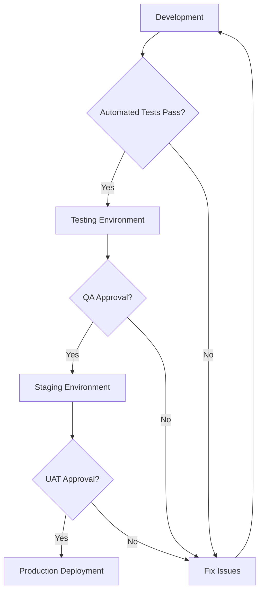

# CI/CD Framework

## Overview

This CI/CD framework provides comprehensive guidance for implementing continuous integration and deployment practices, including pipeline automation, deployment strategies, and monitoring integration. It emphasizes security, reliability, and rapid feedback loops.

## CI/CD Philosophy

### Core Principles

1. **Automate Everything**: Minimize manual intervention in delivery pipeline
2. **Fast Feedback**: Rapid detection and notification of issues
3. **Security First**: Security validation throughout the pipeline
4. **Immutable Deployments**: Consistent, reproducible deployments
5. **Progressive Delivery**: Risk mitigation through gradual rollouts
6. **Observability**: Comprehensive monitoring and logging

### Pipeline Components

- [**Build Pipelines**](./pipelines/README.md) - Automated build and validation
- [**Deployment Strategies**](./deployment/README.md) - Release management approaches
- [**Monitoring Integration**](./monitoring/README.md) - Observability and alerting

## Pipeline Architecture


### Pipeline Stages

| Stage        | Purpose                                 | Tools                   | Duration | Failure Action    |
| ------------ | --------------------------------------- | ----------------------- | -------- | ----------------- |
| **Source**   | Code checkout and preparation           | Git, GitHub             | <30s     | Retry             |
| **Build**    | Compile, package, and prepare artifacts | Maven, npm, Docker      | <5m      | Fail fast         |
| **Test**     | Unit, integration, and security testing | JUnit, pytest, Jest     | <10m     | Block progression |
| **Security** | SAST, DAST, and dependency scanning     | SonarQube, OWASP ZAP    | <15m     | Security review   |
| **Package**  | Create deployment artifacts             | Docker, Helm, Terraform | <3m      | Retry             |
| **Deploy**   | Environment deployment and validation   | Kubernetes, AWS, Azure  | <5m      | Rollback          |
| **Validate** | Post-deployment testing and monitoring  | Automated tests, APM    | <10m     | Investigate       |

## Build Pipeline Framework

### Build Configuration

```yaml
# .github/workflows/ci.yml
name: Continuous Integration
on:
  push:
    branches: [main, develop]
  pull_request:
    branches: [main]

jobs:
  build:
    runs-on: ubuntu-latest
    strategy:
      matrix:
        node-version: [16, 18, 20]

    steps:
      - name: Checkout code
        uses: actions/checkout@v3
        with:
          fetch-depth: 0

      - name: Setup Node.js
        uses: actions/setup-node@v3
        with:
          node-version: ${{ matrix.node-version }}
          cache: 'npm'

      - name: Install dependencies
        run: npm ci

      - name: Lint code
        run: npm run lint

      - name: Run unit tests
        run: npm run test:unit -- --coverage

      - name: Run security audit
        run: npm audit --audit-level=moderate

      - name: Build application
        run: npm run build

      - name: Upload coverage
        uses: codecov/codecov-action@v3
```

### Quality Gates in Pipeline

```yaml
quality_gates:
  code_quality:
    - tool: sonarqube
      quality_gate: passed
      coverage_threshold: 80%
      duplication_threshold: 5%

  security:
    - tool: semgrep
      severity_threshold: high
      fail_on_error: true
    - tool: safety
      vulnerability_database: pyup.io

  performance:
    - tool: lighthouse
      performance_score: 90
      accessibility_score: 95
    - tool: k6
      response_time_p95: 500ms
      error_rate: 1%
```

### Artifact Management

- **Container Registry**: Docker Hub, ECR, GCR, ACR
- **Package Registry**: npm, PyPI, Maven Central, NuGet
- **Binary Storage**: JFrog Artifactory, Nexus Repository
- **Infrastructure Artifacts**: Terraform modules, Helm charts

## Deployment Strategies

### Blue-Green Deployment

```yaml
blue_green_deployment:
  strategy:
    type: blue_green

  environments:
    blue:
      name: production-blue
      weight: 100%
    green:
      name: production-green
      weight: 0%

  rollout_steps:
    - deploy_to_green
    - run_smoke_tests
    - shift_traffic_to_green
    - monitor_health_metrics
    - decommission_blue_on_success
```

**Benefits**: Zero downtime, instant rollback, full testing in production environment  
**Drawbacks**: Resource intensive (2x infrastructure), database compatibility challenges

### Canary Deployment

```yaml
canary_deployment:
  strategy:
    type: canary

  traffic_split:
    initial: 5%
    stages:
      - percentage: 10
        duration: 5m
      - percentage: 25
        duration: 10m
      - percentage: 50
        duration: 15m
      - percentage: 100
        duration: stable

  success_criteria:
    error_rate: <1%
    response_time_p95: <500ms
    custom_metrics:
      - conversion_rate: >2.5%
      - user_satisfaction: >4.0
```

**Benefits**: Risk mitigation, real user feedback, gradual rollout  
**Drawbacks**: Complex routing, longer deployment time, monitoring overhead

### Rolling Deployment

```yaml
rolling_deployment:
  strategy:
    type: rolling

  parameters:
    max_unavailable: 25%
    max_surge: 25%
    batch_size: 2

  health_check:
    initial_delay: 30s
    period: 10s
    timeout: 5s
    success_threshold: 3
    failure_threshold: 3
```

**Benefits**: Gradual rollout, resource efficient, built-in Kubernetes support  
**Drawbacks**: Mixed versions during deployment, potential compatibility issues

### Feature Flag Integration

```python
# Feature flag implementation
from feature_flags import FeatureFlag

@FeatureFlag('new_payment_flow', default=False)
def process_payment(user_id, amount):
    if FeatureFlag.is_enabled('new_payment_flow', user_id):
        return new_payment_processor.process(user_id, amount)
    else:
        return legacy_payment_processor.process(user_id, amount)
```

## Security in CI/CD

### Security Pipeline Integration

```yaml
security_pipeline:
  sast:
    - name: Code Analysis
      tool: semgrep
      config: .semgrep.yml
      fail_on: error

  dependency_check:
    - name: Vulnerability Scan
      tool: safety
      database: pyup.io
      fail_on: high

  secrets_detection:
    - name: Secret Scan
      tool: truffleHog
      entropy_check: true
      regex_check: true

  container_security:
    - name: Image Scan
      tool: trivy
      severity: high,critical
      ignore_unfixed: false

  infrastructure_scan:
    - name: IaC Security
      tool: checkov
      framework: terraform
      fail_on: high
```

### Supply Chain Security

1. **Dependency Management**: Pin versions, verify checksums, use lock files
2. **Build Security**: Secure build environments, immutable build agents
3. **Artifact Signing**: Sign all artifacts with cryptographic signatures
4. **Provenance**: Track artifact origins and build processes
5. **SBOM**: Generate Software Bill of Materials for all components

### Secrets Management

```yaml
secrets_management:
  vault_integration:
    provider: hashicorp_vault
    authentication: kubernetes
    policies: [read_secrets, write_logs]

  secret_injection:
    method: init_container
    rotation: automatic
    expiry: 24h

  secret_scanning:
    pre_commit: true
    pipeline_stage: security
    tools: [truffleHog, git-secrets]
```

## Environment Management

### Environment Strategy

```yaml
environments:
  development:
    purpose: Developer testing and integration
    data: Synthetic/anonymized
    monitoring: Basic
    sla: None

  testing:
    purpose: QA testing and validation
    data: Production-like synthetic
    monitoring: Comprehensive
    sla: 95% uptime

  staging:
    purpose: Pre-production validation
    data: Masked production data
    monitoring: Production-level
    sla: 99% uptime

  production:
    purpose: Live customer-facing
    data: Real production data
    monitoring: Full observability
    sla: 99.9% uptime
```

### Environment Promotion



### Infrastructure as Code

```hcl
# Terraform example for environment provisioning
module "application_environment" {
  source = "./modules/environment"

  environment_name = var.environment_name
  instance_count   = var.instance_count
  instance_type    = var.instance_type

  security_groups = [
    aws_security_group.application.id,
    aws_security_group.database.id
  ]

  monitoring_enabled = var.environment_name != "development"
  backup_enabled     = var.environment_name == "production"
}
```

## Pipeline Monitoring and Observability

### Pipeline Metrics

| Metric                    | Target | Critical |
| ------------------------- | ------ | -------- |
| **Build Success Rate**    | >98%   | >95%     |
| **Build Duration**        | <10m   | <15m     |
| **Deployment Frequency**  | Daily  | Weekly   |
| **Lead Time**             | <4h    | <8h      |
| **Mean Time to Recovery** | <30m   | <1h      |
| **Change Failure Rate**   | <5%    | <10%     |

### Observability Stack

```yaml
observability:
  metrics:
    - prometheus: Pipeline and application metrics
    - grafana: Visualization and alerting
    - statsd: Custom metrics collection

  logging:
    - elasticsearch: Log storage and indexing
    - logstash: Log processing and routing
    - kibana: Log analysis and visualization

  tracing:
    - jaeger: Distributed tracing
    - opentelemetry: Instrumentation framework

  alerting:
    - pagerduty: Incident response
    - slack: Team notifications
    - email: Stakeholder updates
```

### Dashboard Examples

1. **Pipeline Health**: Build success rates, duration trends, failure analysis
2. **Deployment Metrics**: Deployment frequency, success rate, rollback frequency
3. **Quality Metrics**: Test coverage trends, defect rates, security findings
4. **Performance**: Application performance post-deployment, SLA compliance

## Disaster Recovery and Rollback

### Rollback Strategies

```yaml
rollback_procedures:
  automatic_rollback:
    triggers:
      - error_rate > 5%
      - response_time_p95 > 1000ms
      - health_check_failures > 3
    duration: 300s

  manual_rollback:
    authorization: deployment_manager
    notification: all_stakeholders
    documentation: required

  database_rollback:
    strategy: backup_restore
    rpo: 1_hour
    rto: 30_minutes
```

### Backup and Recovery

1. **Database Backups**: Automated daily backups with point-in-time recovery
2. **Configuration Backups**: Version-controlled infrastructure and application config
3. **Artifact Preservation**: Immutable artifact storage with versioning
4. **Recovery Testing**: Regular disaster recovery drills and validation

## Cost Optimization

### Resource Optimization

- **Spot Instances**: Use spot instances for non-critical pipeline stages
- **Caching**: Implement multi-level caching (dependencies, builds, tests)
- **Parallelization**: Run independent pipeline stages in parallel
- **Resource Right-sizing**: Match compute resources to workload requirements

### Pipeline Efficiency

```yaml
optimization_strategies:
  caching:
    - docker_layer_caching: true
    - dependency_caching: true
    - build_artifact_caching: true

  parallelization:
    - test_parallelization: 4
    - build_matrix_parallel: true
    - deployment_parallel_regions: 2

  resource_management:
    - auto_scaling: enabled
    - spot_instances: non_production
    - resource_cleanup: automated
```

---

_Continuous integration and deployment are the heartbeat of modern software development. Our CI/CD framework ensures rapid, secure, and reliable delivery of value to our customers._
