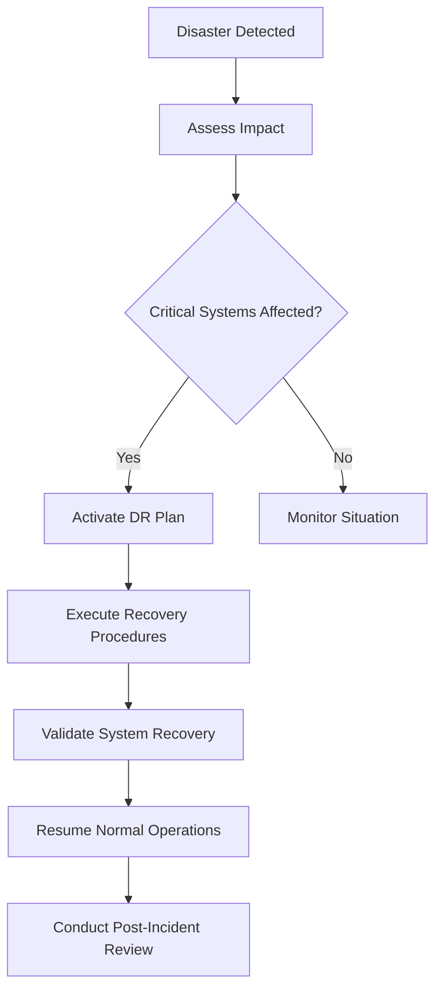

# Business Continuity and Data Lifecycle Management

## Overview

This framework provides comprehensive guidance for disaster recovery, business continuity planning, and data lifecycle management. It ensures organizational resilience and responsible data stewardship throughout the information lifecycle.

## Framework Philosophy

### Core Principles

1. **Resilience**: Ability to withstand and recover from disruptions
2. **Preparedness**: Proactive planning and regular testing
3. **Data Stewardship**: Responsible management throughout data lifecycle
4. **Compliance**: Adherence to legal and regulatory requirements
5. **Continuous Improvement**: Regular review and enhancement of processes

### Framework Components

- [**Disaster Recovery (DR)**](./dr-bcp/disaster-recovery.md) - Technical system recovery
- [**Business Continuity Planning (BCP)**](./dr-bcp/business-continuity.md) - Organizational continuity
- [**Data Lifecycle Management**](./data-lifecycle/README.md) - Information governance
- [**Crisis Management**](./crisis-management.md) - Emergency response coordination

## Disaster Recovery (DR) Framework

### DR Strategy Overview

```yaml
disaster_recovery:
  objectives:
    rto: # Recovery Time Objective
      critical_systems: 1_hour
      important_systems: 4_hours
      standard_systems: 24_hours

    rpo: # Recovery Point Objective
      critical_data: 15_minutes
      important_data: 1_hour
      standard_data: 24_hours

  recovery_tiers:
    tier_1_critical:
      systems: [payment_processing, user_authentication, core_api]
      rto: 1_hour
      rpo: 15_minutes
      recovery_method: hot_standby

    tier_2_important:
      systems: [reporting, analytics, customer_portal]
      rto: 4_hours
      rpo: 1_hour
      recovery_method: warm_standby

    tier_3_standard:
      systems: [internal_tools, documentation, monitoring]
      rto: 24_hours
      rpo: 24_hours
      recovery_method: cold_backup
```

### DR Architecture Patterns

#### Multi-Region Active-Passive

```yaml
active_passive_dr:
  primary_region: us-east-1
  secondary_region: us-west-2

  replication:
    database: streaming_replication
    storage: cross_region_replication
    configuration: automated_sync

  failover:
    trigger: automated_health_checks
    dns_cutover: route53_health_checks
    application_startup: automated_deployment

  failback:
    trigger: manual_after_validation
    data_sync: bidirectional_replication
    verification: comprehensive_testing
```

#### Multi-Region Active-Active

```yaml
active_active_dr:
  regions: [us-east-1, us-west-2, eu-west-1]

  load_distribution:
    method: geographic_routing
    health_checks: continuous_monitoring
    traffic_distribution: 34%-33%-33%

  data_consistency:
    strategy: eventual_consistency
    conflict_resolution: last_writer_wins
    synchronization: multi_master_replication

  failure_handling:
    automatic_failover: enabled
    degraded_mode: read_only_operation
    recovery: automatic_rejoin
```

### DR Testing Framework

```yaml
dr_testing:
  test_types:
    tabletop_exercise:
      frequency: quarterly
      participants: [leadership, key_stakeholders]
      duration: 2_hours
      focus: decision_making_processes

    partial_failover:
      frequency: monthly
      scope: non_critical_systems
      duration: 4_hours
      focus: technical_procedures

    full_failover:
      frequency: annually
      scope: all_systems
      duration: 8_hours
      focus: end_to_end_recovery

  success_criteria:
    rto_achievement: must_meet_targets
    rpo_validation: data_loss_within_limits
    stakeholder_notification: timely_communication
    system_functionality: full_operational_capability
```

### DR Procedures

#### Emergency Response Team

| Role                    | Responsibilities              | Contact Method            | Backup             |
| ----------------------- | ----------------------------- | ------------------------- | ------------------ |
| **Incident Commander**  | Overall response coordination | Primary phone + PagerDuty | Deputy IC          |
| **Technical Lead**      | System recovery execution     | Slack + Phone             | Senior Engineer    |
| **Communications Lead** | Stakeholder communication     | Email + Slack             | Marketing Manager  |
| **Business Lead**       | Business impact assessment    | Phone + Teams             | Operations Manager |

#### DR Activation Process



## Business Continuity Planning (BCP)

### BCP Framework

```yaml
business_continuity:
  critical_business_functions:
    customer_service:
      minimum_staffing: 75%
      alternate_location: remote_work
      technology_requirements: [laptop, vpn, phone_system]

    order_processing:
      minimum_staffing: 90%
      alternate_location: secondary_office
      technology_requirements: [erp_access, payment_gateway]

    software_development:
      minimum_staffing: 50%
      alternate_location: remote_work
      technology_requirements: [development_tools, code_repository]

  alternate_work_arrangements:
    remote_work:
      capacity: 100%_of_staff
      technology: laptop + vpn + cloud_services
      duration: indefinite

    secondary_office:
      capacity: 25%_of_staff
      technology: basic_workstations + network
      duration: 30_days

    partner_facility:
      capacity: 10%_of_staff
      technology: basic_connectivity
      duration: 7_days
```

### Crisis Communication Plan

```yaml
communication_plan:
  internal_communication:
    all_hands_meeting:
      timing: within_2_hours
      method: video_conference
      attendees: all_employees

    leadership_updates:
      timing: every_4_hours
      method: email + slack
      attendees: management_team

    team_coordination:
      timing: hourly
      method: slack_channels
      attendees: affected_teams

  external_communication:
    customer_notification:
      timing: within_1_hour
      method: email + status_page
      content: impact_and_eta

    partner_notification:
      timing: within_2_hours
      method: phone + email
      content: business_impact

    regulatory_notification:
      timing: as_required
      method: formal_submission
      content: compliance_report
```

### Supply Chain Continuity

- **Vendor Risk Assessment**: Regular evaluation of critical suppliers
- **Alternative Suppliers**: Identified backup vendors for key services
- **Contract Provisions**: Force majeure and continuity clauses
- **Inventory Management**: Strategic stockpiling of critical supplies

## Data Lifecycle Management

### Data Classification Framework

```yaml
data_classification:
  public:
    definition: Information intended for public consumption
    examples: [marketing_materials, public_documentation]
    retention: indefinite
    protection: standard_backup

  internal:
    definition: Information for internal business use
    examples: [policies, procedures, internal_reports]
    retention: 7_years
    protection: access_controls + backup

  confidential:
    definition: Sensitive business information
    examples: [financial_reports, customer_data, contracts]
    retention: varies_by_type
    protection: encryption + access_controls + audit_logs

  restricted:
    definition: Highly sensitive regulated information
    examples: [pii, phi, payment_card_data]
    retention: minimal_required_by_law
    protection: encryption + strict_access + monitoring
```

### Data Lifecycle Stages

#### 1. Data Creation/Collection

```yaml
data_creation:
  requirements:
    - legal_basis_documented
    - purpose_limitation_defined
    - retention_period_specified
    - protection_requirements_identified

  controls:
    - data_quality_validation
    - source_authentication
    - initial_classification
    - metadata_tagging
```

#### 2. Data Storage and Processing

```yaml
data_processing:
  storage_requirements:
    encryption_at_rest: required_for_confidential_and_above
    access_controls: role_based_minimum_privilege
    geographic_restrictions: comply_with_data_residency_laws
    backup_strategy: 3-2-1_backup_rule

  processing_controls:
    encryption_in_transit: tls_1.3_minimum
    processing_logs: comprehensive_audit_trail
    data_lineage: track_data_transformations
    quality_monitoring: automated_quality_checks
```

#### 3. Data Sharing and Distribution

```yaml
data_sharing:
  internal_sharing:
    authorization: data_owner_approval
    access_logging: all_access_logged
    time_limits: session_based_expiration

  external_sharing:
    legal_agreements: data_processing_agreements
    recipient_validation: approved_vendor_list
    transfer_security: encrypted_channels_only
    purpose_limitation: specific_use_cases_only
```

#### 4. Data Archival

```yaml
data_archival:
  archival_triggers:
    - retention_period_threshold
    - business_process_completion
    - regulatory_requirement

  archival_process:
    - data_integrity_verification
    - metadata_preservation
    - access_restriction_application
    - storage_tier_migration

  archival_storage:
    format: industry_standard_formats
    media: durable_storage_media
    location: secure_offsite_facility
    access: controlled_retrieval_process
```

#### 5. Data Destruction

```yaml
data_destruction:
  destruction_triggers:
    - retention_period_expiry
    - business_purpose_cessation
    - individual_rights_request
    - legal_obligation_fulfillment

  destruction_methods:
    digital_media: cryptographic_erasure
    physical_media: physical_destruction
    cloud_storage: secure_deletion_apis
    backup_media: coordinated_destruction

  verification:
    - certificate_of_destruction
    - audit_log_entry
    - stakeholder_notification
    - compliance_documentation
```

### Data Governance Framework

```yaml
data_governance:
  roles_and_responsibilities:
    chief_data_officer:
      responsibilities: [strategy, governance, compliance]
      authority: enterprise_data_decisions

    data_stewards:
      responsibilities: [quality, metadata, access_controls]
      authority: domain_specific_decisions

    data_custodians:
      responsibilities: [technical_implementation, security]
      authority: operational_decisions

    data_users:
      responsibilities: [appropriate_use, quality_reporting]
      authority: consumption_within_scope

  governance_processes:
    data_catalog_maintenance:
      frequency: continuous
      responsibility: data_stewards

    access_review:
      frequency: quarterly
      responsibility: data_owners

    quality_assessment:
      frequency: monthly
      responsibility: data_stewards

    compliance_audit:
      frequency: annually
      responsibility: compliance_team
```

### Data Protection Impact Assessment (DPIA)

```yaml
dpia_framework:
  trigger_conditions:
    - high_risk_processing
    - new_technology_usage
    - systematic_monitoring
    - sensitive_data_processing
    - large_scale_processing

  assessment_process:
    1_description: describe_processing_operation
    2_necessity: assess_necessity_and_proportionality
    3_risks: identify_risks_to_individuals
    4_measures: propose_mitigation_measures
    5_consultation: stakeholder_consultation
    6_decision: approve_or_reject_processing

  review_frequency: annually_or_upon_significant_change
```

## Crisis Management

### Crisis Response Team

| Role                      | Primary         | Backup             | Responsibilities                                 |
| ------------------------- | --------------- | ------------------ | ------------------------------------------------ |
| **Crisis Commander**      | CEO             | COO                | Overall response strategy and external relations |
| **Operations Lead**       | CTO             | VP Engineering     | Technical response and system recovery           |
| **Communications Lead**   | CMO             | PR Director        | Media relations and public communication         |
| **Legal/Compliance Lead** | General Counsel | Compliance Officer | Regulatory obligations and legal implications    |
| **HR Lead**               | CHRO            | HR Director        | Employee safety and business continuity          |

### Crisis Escalation Matrix

```yaml
crisis_levels:
  level_1_minor:
    definition: Limited impact, routine response
    examples: [single_server_failure, minor_security_incident]
    response_team: operations_team
    notification: internal_stakeholders

  level_2_moderate:
    definition: Significant impact, coordinated response
    examples: [service_degradation, data_privacy_incident]
    response_team: crisis_response_team
    notification: customers + partners

  level_3_major:
    definition: Severe impact, full mobilization
    examples: [major_outage, security_breach, natural_disaster]
    response_team: full_crisis_team
    notification: public + regulatory

  level_4_critical:
    definition: Existential threat, emergency response
    examples: [catastrophic_system_failure, major_security_breach]
    response_team: executive_leadership + external_experts
    notification: all_stakeholders + media
```

---

_Resilience is not just about surviving disruptions—it's about emerging stronger and more prepared for future challenges._
