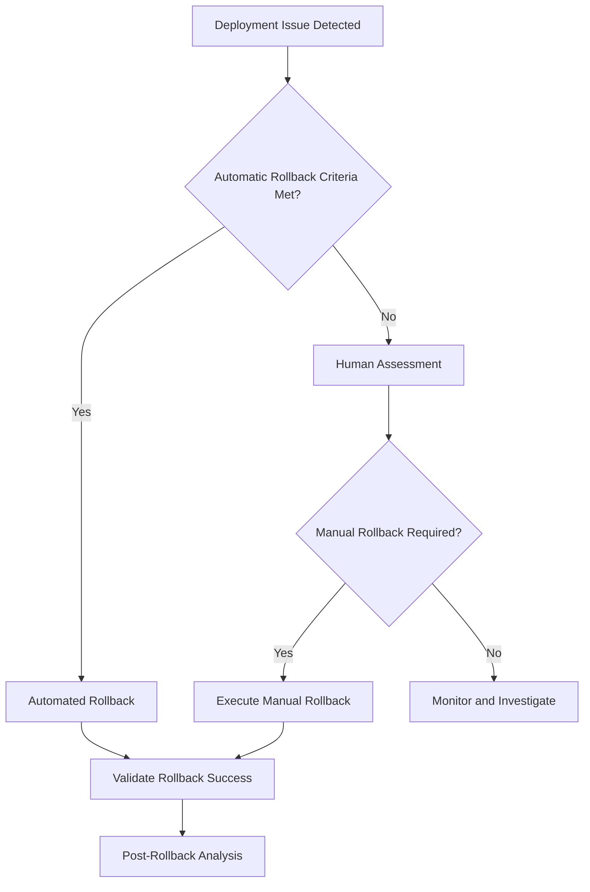

# Operations Framework

## Overview

This operations framework provides comprehensive guidance for runtime management, observability, rollback procedures, canary deployments, and deprecation processes. It emphasizes operational excellence, reliability, and continuous improvement.

## Operational Philosophy

### Core Principles

1. **Reliability First**: System stability and availability are paramount
2. **Observability**: Deep visibility into system behavior and performance
3. **Automation**: Reduce manual intervention and human error
4. **Gradual Changes**: Minimize risk through incremental deployments
5. **Quick Recovery**: Rapid detection and resolution of issues
6. **Continuous Learning**: Learn from incidents to improve systems

### Framework Components

- [**Observability**](./observability/README.md) - Monitoring, logging, and alerting
- [**Rollback Procedures**](./rollback-canary/rollback.md) - Safe deployment reversals
- [**Canary Deployments**](./rollback-canary/canary.md) - Risk-mitigated releases
- [**Deprecation Management**](./deprecation/README.md) - Systematic feature retirement
- [**Incident Management**](./incident-management.md) - Structured incident response

## Observability Framework

### Three Pillars of Observability

1. **Metrics**: Quantitative measurements over time
2. **Logs**: Discrete event records with context
3. **Traces**: Request flow through distributed systems

### Observability Stack

```yaml
observability_stack:
  metrics:
    collection: Prometheus, StatsD, DataDog
    visualization: Grafana, DataDog, New Relic
    alerting: AlertManager, PagerDuty

  logging:
    collection: Fluentd, Logstash, Vector
    storage: Elasticsearch, Loki, Splunk
    analysis: Kibana, Grafana, Datadog

  tracing:
    instrumentation: OpenTelemetry, Jaeger, Zipkin
    collection: OTEL Collector, Jaeger Agent
    analysis: Jaeger UI, DataDog APM

  synthetic_monitoring:
    uptime: Pingdom, StatusCake
    performance: WebPageTest, SpeedCurve
    functionality: Selenium, Cypress
```

### Key Metrics Categories

#### Golden Signals (SRE)

1. **Latency**: Time to process requests
2. **Traffic**: Demand on the system
3. **Errors**: Rate of failed requests
4. **Saturation**: Resource utilization

#### USE Method (Infrastructure)

1. **Utilization**: Resource busy time percentage
2. **Saturation**: Resource queuing/waiting
3. **Errors**: Error count and rate

#### RED Method (Applications)

1. **Rate**: Requests per second
2. **Errors**: Error percentage
3. **Duration**: Response time distribution

### Alerting Strategy

```yaml
alerting_framework:
  severity_levels:
    critical:
      sla_impact: true
      escalation: immediate
      examples: [service_down, security_breach, data_loss]

    high:
      sla_impact: potential
      escalation: 15_minutes
      examples: [performance_degradation, high_error_rate]

    medium:
      sla_impact: false
      escalation: 1_hour
      examples: [resource_usage_high, cache_miss_rate_high]

    low:
      sla_impact: false
      escalation: next_business_day
      examples: [disk_space_warning, certificate_expiry]

  notification_channels:
    critical: [pagerduty, phone_call, slack_channel]
    high: [pagerduty, slack_channel, email]
    medium: [slack_channel, email]
    low: [email, jira_ticket]
```

### Dashboard Strategy

```yaml
dashboard_hierarchy:
  executive_dashboard:
    audience: C-level, VP-level
    metrics: [sla_compliance, revenue_impact, customer_satisfaction]
    refresh: hourly

  operational_dashboard:
    audience: Operations teams, SRE
    metrics: [system_health, performance, capacity]
    refresh: real_time

  application_dashboard:
    audience: Development teams
    metrics: [application_metrics, deployment_status, error_rates]
    refresh: real_time

  business_dashboard:
    audience: Product teams
    metrics: [user_engagement, conversion_rates, feature_usage]
    refresh: hourly
```

## Rollback Procedures

### Rollback Strategy Framework



### Rollback Types

1. **Database Rollbacks**: Schema and data reversions
2. **Application Rollbacks**: Code deployment reversions
3. **Configuration Rollbacks**: Settings and parameter reversions
4. **Infrastructure Rollbacks**: Resource and topology reversions

### Automated Rollback Triggers

```yaml
rollback_triggers:
  error_rate:
    threshold: 5%
    window: 5_minutes
    action: immediate_rollback

  response_time:
    threshold: 95th_percentile > 1000ms
    window: 3_minutes
    action: immediate_rollback

  availability:
    threshold: <99%
    window: 2_minutes
    action: immediate_rollback

  custom_metrics:
    business_conversion_rate:
      threshold: <90% of_baseline
      window: 10_minutes
      action: alert_and_rollback_option
```

### Rollback Process

1. **Detection**: Automated monitoring or human observation
2. **Assessment**: Evaluate impact and rollback necessity
3. **Authorization**: Approve rollback (automated or manual)
4. **Execution**: Perform rollback steps in correct order
5. **Validation**: Verify rollback success and system health
6. **Communication**: Notify stakeholders of rollback completion
7. **Analysis**: Post-rollback review and lessons learned

### Rollback Validation Checklist

```yaml
rollback_validation:
  application_health:
    - [ ] Application starts successfully
    - [ ] Health checks pass
    - [ ] Core functionality works
    - [ ] Error rates return to baseline

  data_integrity:
    - [ ] Database consistency verified
    - [ ] No data corruption detected
    - [ ] Backup systems functional
    - [ ] Data synchronization working

  external_integrations:
    - [ ] API connections restored
    - [ ] Third-party services responding
    - [ ] Message queues processing
    - [ ] Authentication systems working

  performance:
    - [ ] Response times within SLA
    - [ ] Throughput at expected levels
    - [ ] Resource utilization normal
    - [ ] Cache performance restored
```

## Canary Deployment Framework

### Canary Strategy

```yaml
canary_deployment:
  traffic_routing:
    initial_percentage: 5%
    increment_steps: [10%, 25%, 50%, 100%]
    increment_duration: 15_minutes

  success_criteria:
    error_rate: <1%
    p95_latency: <200ms
    p99_latency: <500ms
    conversion_rate: >95% of baseline

  monitoring_period: 30_minutes

  rollback_triggers:
    error_rate: >2%
    latency_p95: >300ms
    custom_business_metrics: <90% baseline
```

### Canary Implementation Patterns

#### Traffic-Based Canary

```yaml
traffic_canary:
  implementation: load_balancer_routing
  granularity: percentage_of_requests
  control: real_time_adjustment
  tools: [istio, envoy, nginx, aws_alb]
```

#### User-Based Canary

```yaml
user_canary:
  implementation: feature_flags
  granularity: user_segments
  control: user_attributes
  tools: [launchdarkly, split, unleash]
```

#### Geographic Canary

```yaml
geographic_canary:
  implementation: dns_routing
  granularity: regions_or_datacenters
  control: geographic_distribution
  tools: [route53, cloudflare, azure_traffic_manager]
```

### Canary Monitoring Dashboard

```yaml
canary_metrics:
  deployment_health:
    - deployment_success_rate
    - rollback_frequency
    - canary_duration_average

  application_health:
    - error_rate_comparison
    - latency_percentile_comparison
    - throughput_comparison

  business_metrics:
    - conversion_rate_impact
    - user_experience_scores
    - revenue_impact_tracking
```

## Deprecation Management

### Deprecation Lifecycle


### Deprecation Process

1. **Assessment Phase** (Timeline: -12 months)
   - Usage analysis and impact assessment
   - Stakeholder identification and consultation
   - Alternative solution identification
   - Cost-benefit analysis of deprecation

2. **Announcement Phase** (Timeline: -9 months)
   - Public deprecation notice
   - Migration guide creation
   - Stakeholder communication plan
   - Timeline and milestone communication

3. **Migration Phase** (Timeline: -6 months)
   - Migration tool and documentation provision
   - Customer support and consultation
   - Progress tracking and reporting
   - Timeline adjustment if needed

4. **Sunset Phase** (Timeline: -3 months)
   - Final migration reminders
   - Support reduction announcements
   - Removal date confirmation
   - Emergency contact establishment

5. **Removal Phase** (Timeline: 0)
   - Feature deactivation
   - Code removal
   - Documentation archival
   - Infrastructure cleanup

6. **Post-Removal Phase** (Timeline: +1 month)
   - Impact monitoring
   - Issue resolution
   - Lessons learned documentation
   - Process improvement

### Deprecation Communication Template

```yaml
deprecation_notice:
  feature_name: '[Feature Name]'
  deprecation_date: 'YYYY-MM-DD'
  removal_date: 'YYYY-MM-DD'

  rationale:
    - reason_1: 'Low usage and maintenance burden'
    - reason_2: 'Security concerns and compliance issues'
    - reason_3: 'Better alternatives available'

  impact_assessment:
    affected_users: '[Number or percentage]'
    affected_systems: '[List of systems]'
    business_impact: '[High/Medium/Low]'

  migration_path:
    recommended_solution: '[Alternative feature/service]'
    migration_timeline: '[Duration needed]'
    support_available: '[Type of support offered]'

  support_resources:
    documentation: '[URL to migration guide]'
    contact: '[Support team contact]'
    timeline: '[Support availability period]'
```

### Deprecation Metrics

- **Usage Decline Rate**: Percentage reduction in feature usage
- **Migration Completion Rate**: Percentage of users migrated to alternatives
- **Support Request Volume**: Number of deprecation-related support requests
- **Business Impact**: Revenue or operational impact of deprecation

## Incident Management

### Incident Severity Classification

| Severity  | Definition                                       | Example                       | Response Time  | Escalation        |
| --------- | ------------------------------------------------ | ----------------------------- | -------------- | ----------------- |
| **SEV-1** | Critical system failure, complete service outage | API completely down           | 15 minutes     | Immediate         |
| **SEV-2** | Significant service degradation                  | Performance severely impacted | 1 hour         | Within 30 minutes |
| **SEV-3** | Minor service impact                             | Non-critical feature broken   | 4 hours        | Within 2 hours    |
| **SEV-4** | Low impact issues                                | Cosmetic issues, minor bugs   | 1 business day | Next business day |

### Incident Response Process

1. **Detection**: Automated alerts or human reporting
2. **Response**: On-call engineer acknowledges and assesses
3. **Escalation**: Appropriate team members engaged
4. **Investigation**: Root cause analysis and diagnosis
5. **Resolution**: Implement fix and validate resolution
6. **Communication**: Update stakeholders throughout process
7. **Post-Mortem**: Conduct blameless post-incident review

### On-Call Management

```yaml
on_call_schedule:
  primary_rotation: 1_week
  secondary_rotation: 1_week
  escalation_timeout: 5_minutes

  responsibilities:
    - acknowledge_alerts_within: 5_minutes
    - provide_status_updates_every: 30_minutes
    - escalate_if_no_progress_within: 30_minutes

  tools:
    - pagerduty: alert_management
    - slack: communication
    - jira: ticket_tracking
    - confluence: runbook_access
```

### Service Level Objectives (SLOs)

```yaml
service_slos:
  availability:
    target: 99.9%
    measurement_window: 30_days
    error_budget: 43.2_minutes_per_month

  latency:
    p50_target: 100ms
    p95_target: 200ms
    p99_target: 500ms
    measurement_window: 7_days

  error_rate:
    target: <0.1%
    measurement_window: 24_hours

  throughput:
    target: '>1000_rps'
    measurement_window: 1_hour
```

---

_Operations excellence is achieved through careful attention to observability, disciplined deployment practices, and continuous learning from our experiences._
