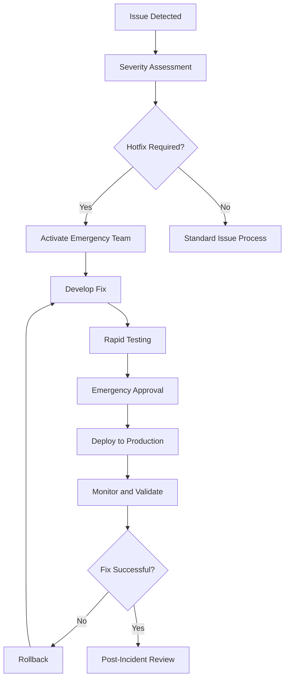
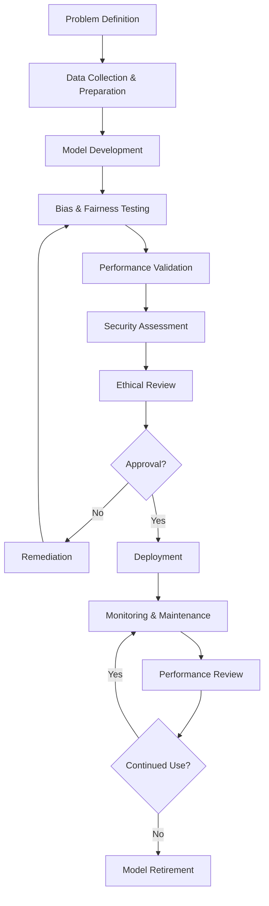

# Specialized Processes

## Overview

This section covers specialized processes that are critical to modern software development but require specific expertise and dedicated procedures. It includes hotfix procedures, internationalization (I18n) and accessibility (A11y) guidelines, and AI model risk management.

## Process Philosophy

### Core Principles

1. **Emergency Preparedness**: Ready procedures for critical situations
2. **Inclusive Design**: Accessible and globally usable software
3. **Responsible AI**: Ethical and safe AI system deployment
4. **Risk Mitigation**: Proactive identification and management of specialized risks
5. **Continuous Learning**: Evolve processes based on experience and best practices

### Framework Components

- [**Hotfix Procedures**](./hotfix/README.md) - Emergency fix deployment process
- [**Internationalization (I18n)**](./i18n-a11y/i18n.md) - Global software design
- [**Accessibility (A11y)**](./i18n-a11y/a11y.md) - Inclusive software design
- [**AI Model Risk Management**](./ai-model-risk/README.md) - Responsible AI deployment

## Hotfix Process

### Hotfix Definition and Criteria

```yaml
hotfix_criteria:
  severity_classification:
    critical:
      definition: System completely unavailable or major security vulnerability
      examples: [complete_service_outage, data_breach, payment_system_failure]
      response_time: immediate
      approval_level: incident_commander

    high:
      definition: Significant functionality broken affecting many users
      examples: [major_feature_unavailable, performance_severely_degraded]
      response_time: within_2_hours
      approval_level: engineering_director

    medium:
      definition: Important functionality impaired but workarounds exist
      examples: [specific_feature_broken, moderate_performance_impact]
      response_time: within_8_hours
      approval_level: engineering_manager
```

### Emergency Response Team

| Role                    | Primary                     | Backup                     | Responsibilities                  |
| ----------------------- | --------------------------- | -------------------------- | --------------------------------- |
| **Incident Commander**  | On-call Engineering Manager | Senior Engineering Manager | Overall response coordination     |
| **Technical Lead**      | On-call Senior Engineer     | Principal Engineer         | Technical solution development    |
| **Release Manager**     | DevOps Lead                 | Senior DevOps Engineer     | Deployment and rollback execution |
| **Communications Lead** | Product Manager             | Customer Success Manager   | Stakeholder communication         |
| **Quality Assurance**   | On-call QA Lead             | Senior QA Engineer         | Risk assessment and validation    |

### Hotfix Process Flow



### Hotfix Development Process

```yaml
hotfix_development:
  branch_strategy:
    source_branch: production_main_branch
    hotfix_branch: hotfix/{issue_id}_{date}
    merge_strategy: fast_forward_to_main_and_develop

  code_requirements:
    minimal_changes: only_fix_specific_issue
    no_feature_additions: emergency_fixes_only
    comprehensive_comments: explain_why_and_how
    rollback_plan: clear_rollback_procedure

  testing_requirements:
    automated_tests: run_full_regression_suite
    manual_testing: focused_testing_on_affected_areas
    performance_testing: validate_no_performance_degradation
    security_testing: security_impact_assessment

  approval_process:
    code_review: senior_engineer_approval
    security_review: security_team_sign_off_if_applicable
    business_approval: product_owner_awareness
    deployment_approval: incident_commander_final_approval
```

### Expedited Quality Gates

```yaml
emergency_gates:
  code_review:
    reviewers: minimum_2_senior_engineers
    timeline: within_30_minutes
    focus: [correctness, security, rollback_safety]

  testing:
    automated: full_ci_pipeline_must_pass
    manual: focused_testing_on_critical_paths
    timeline: maximum_1_hour

  security_review:
    trigger: any_security_related_changes
    reviewer: security_team_member
    timeline: within_15_minutes

  deployment_approval:
    authority: incident_commander
    requirements: [testing_complete, rollback_plan_ready, communication_plan_active]
    documentation: approval_reason_and_risk_assessment
```

### Post-Hotfix Procedures

1. **Immediate Monitoring**: Enhanced monitoring for 24 hours post-deployment
2. **Communication Updates**: Status updates to all stakeholders
3. **Documentation**: Complete incident documentation and timeline
4. **Process Integration**: Merge hotfix changes into development branches
5. **Post-Incident Review**: Conduct blameless post-mortem within 48 hours
6. **Process Improvement**: Update procedures based on lessons learned

## Internationalization (I18n) Framework

### I18n Strategy and Planning

```yaml
i18n_framework:
  target_markets:
    primary: [US, Canada, UK, Australia]
    secondary: [Germany, France, Spain, Netherlands]
    future: [Japan, Brazil, India, China]

  localization_scope:
    user_interface: all_user_facing_text
    documentation: user_guides_and_help_content
    marketing: website_and_promotional_materials
    legal: terms_of_service_and_privacy_policy

  cultural_considerations:
    date_formats: locale_specific_formatting
    number_formats: currency_and_numeric_conventions
    text_direction: ltr_and_rtl_language_support
    color_meanings: cultural_color_associations
    imagery: culturally_appropriate_visuals
```

### Technical Implementation

```yaml
technical_architecture:
  text_externalization:
    resource_files: json_or_properties_files
    key_naming: hierarchical_namespace_structure
    placeholder_support: variable_substitution
    pluralization: icu_message_format_support

  locale_management:
    detection: [user_preference, browser_language, geo_ip]
    fallback_strategy: primary_language_then_english
    dynamic_switching: runtime_language_change

  content_management:
    translation_workflow: professional_translation_service
    quality_assurance: native_speaker_review
    version_control: translation_memory_management
    automation: ci_cd_integration_for_translations
```

### I18n Development Guidelines

```javascript
// Good I18n practices
const messages = {
  'user.welcome': 'Welcome, {userName}!',
  'item.count': {
    'zero': 'No items',
    'one': '{count} item',
    'other': '{count} items'
  },
  'date.format': 'MMMM dd, yyyy'
};

// Avoid hardcoded strings
const badExample = <button>Submit</button>;
const goodExample = <button>{t('button.submit')}</button>;

// Handle text expansion
const shortText = 'OK';      // 2 characters in English
const germanText = 'Einverstanden'; // 13 characters in German

// Consider RTL languages
.text-content {
  text-align: start; /* not left */
  margin-inline-start: 1rem; /* not margin-left */
}
```

### Translation Management Process

1. **String Extraction**: Automated extraction of translatable strings
2. **Translation Preparation**: Context and comments for translators
3. **Professional Translation**: Certified translation services
4. **Quality Review**: Native speaker validation
5. **Integration Testing**: Functional testing in target languages
6. **Cultural Review**: Cultural appropriateness assessment
7. **Continuous Updates**: Ongoing translation maintenance

## Accessibility (A11y) Framework

### Accessibility Standards and Compliance

```yaml
a11y_compliance:
  standards:
    wcag_2.1: Web Content Accessibility Guidelines Level AA
    section_508: US Federal accessibility requirements
    ada_compliance: Americans with Disabilities Act
    en_301_549: European accessibility standard

  success_criteria:
    level_a: minimum_accessibility_threshold
    level_aa: standard_compliance_target
    level_aaa: enhanced_accessibility_gold_standard

  testing_requirements:
    automated_testing: axe_core_lighthouse_wave
    manual_testing: keyboard_navigation_screen_reader
    user_testing: actual_users_with_disabilities
    expert_review: accessibility_specialist_audit
```

### Accessibility Implementation Guidelines

```yaml
a11y_principles:
  perceivable:
    - provide_text_alternatives_for_images
    - offer_captions_and_transcripts_for_media
    - ensure_sufficient_color_contrast
    - support_text_resize_up_to_200_percent

  operable:
    - make_all_functionality_keyboard_accessible
    - provide_users_enough_time_to_read_content
    - avoid_content_that_causes_seizures
    - help_users_navigate_and_find_content

  understandable:
    - make_text_readable_and_understandable
    - make_content_appear_and_operate_predictably
    - help_users_avoid_and_correct_mistakes

  robust:
    - maximize_compatibility_with_assistive_technologies
    - use_valid_semantic_html
    - ensure_content_works_across_browsers_and_devices
```

### Accessibility Development Practices

```html
<!-- Semantic HTML structure -->
<main>
  <section>
    <h2>Section Title</h2>
    <article>
      <h3>Article Title</h3>
      <p>Content with proper heading hierarchy</p>
    </article>
  </section>
</main>

<!-- Proper form labeling -->
<label for="email">Email Address (required)</label>
<input type="email" id="email" required aria-describedby="email-help" aria-invalid="false" />
<div id="email-help">We'll never share your email</div>

<!-- Button accessibility -->
<button type="button" aria-label="Close dialog" aria-expanded="false" onclick="closeModal()">
  <span aria-hidden="true">&times;</span>
</button>

<!-- Image accessibility -->

```

### Accessibility Testing Framework

```yaml
a11y_testing:
  automated_testing:
    tools: [axe_core, lighthouse, wave, pa11y]
    integration: ci_cd_pipeline_automated_checks
    coverage: all_pages_and_components

  manual_testing:
    keyboard_navigation: tab_order_and_focus_management
    screen_reader: nvda_jaws_voiceover_testing
    magnification: content_usability_at_200_percent_zoom

  user_testing:
    participants: users_with_various_disabilities
    frequency: quarterly_usability_sessions
    feedback: incorporation_into_development_process
```

## AI Model Risk Management

### AI Risk Categories

```yaml
ai_risk_framework:
  model_risks:
    bias_and_fairness:
      definition: discriminatory_outcomes_across_demographics
      examples: [hiring_bias, loan_approval_discrimination]
      mitigation: bias_testing_fairness_metrics

    accuracy_and_reliability:
      definition: model_predictions_incorrect_or_inconsistent
      examples: [medical_misdiagnosis, financial_miscalculation]
      mitigation: validation_testing_performance_monitoring

    adversarial_attacks:
      definition: malicious_inputs_designed_to_fool_model
      examples: [image_classification_poisoning, text_generation_manipulation]
      mitigation: adversarial_training_input_validation

    privacy_and_data_protection:
      definition: unauthorized_disclosure_of_training_data
      examples: [membership_inference, model_inversion_attacks]
      mitigation: differential_privacy_data_minimization

    explainability_and_transparency:
      definition: inability_to_understand_model_decisions
      examples: [black_box_recommendations, opaque_risk_scoring]
      mitigation: explainable_ai_techniques_documentation
```

### AI Governance Framework

```yaml
ai_governance:
  oversight_structure:
    ai_ethics_board:
      composition: [ethicist, technical_expert, legal_counsel, business_representative]
      responsibilities: [policy_development, risk_assessment, approval_authority]
      meeting_frequency: quarterly_or_as_needed

    model_review_committee:
      composition: [data_scientists, domain_experts, security_specialist]
      responsibilities: [technical_review, validation, ongoing_monitoring]
      review_frequency: per_model_deployment_and_quarterly

  approval_process:
    model_development_approval:
      triggers: [new_model_development, significant_model_changes]
      requirements: [business_case, risk_assessment, ethical_review]

    deployment_approval:
      triggers: [production_deployment, model_updates]
      requirements: [performance_validation, security_review, monitoring_plan]

    ongoing_governance:
      triggers: [performance_degradation, bias_detection, regulatory_changes]
      requirements: [impact_assessment, remediation_plan, stakeholder_communication]
```

### Model Development Lifecycle



### AI Risk Assessment Process

```yaml
risk_assessment:
  impact_analysis:
    stakeholder_identification: who_is_affected_by_model_decisions
    consequence_assessment: potential_harm_from_incorrect_decisions
    scale_evaluation: number_of_people_or_decisions_affected

  likelihood_assessment:
    historical_performance: past_accuracy_and_reliability_metrics
    environmental_factors: data_drift_and_concept_drift_risks
    adversarial_threats: potential_attack_vectors_and_motivations

  risk_scoring:
    calculation: impact_score_x_likelihood_score
    categorization: [low_risk, medium_risk, high_risk, unacceptable_risk]
    approval_requirements: risk_level_determines_approval_authority

  mitigation_planning:
    preventive_measures: reduce_likelihood_of_risk_occurrence
    protective_measures: limit_impact_if_risk_materializes
    contingency_plans: response_procedures_for_risk_events
```

### Continuous Monitoring and Maintenance

```yaml
model_monitoring:
  performance_metrics:
    accuracy: prediction_correctness_over_time
    drift_detection: data_and_concept_drift_monitoring
    fairness_metrics: ongoing_bias_detection_across_demographics

  operational_metrics:
    latency: response_time_for_predictions
    throughput: requests_processed_per_second
    availability: model_service_uptime

  business_metrics:
    conversion_impact: effect_on_business_objectives
    user_satisfaction: feedback_and_complaint_analysis
    regulatory_compliance: adherence_to_applicable_regulations

  alerting_thresholds:
    performance_degradation: accuracy_below_acceptable_threshold
    bias_detection: fairness_metrics_outside_acceptable_range
    operational_issues: latency_or_availability_problems
```

### Model Retirement Process

1. **Retirement Triggers**: Performance degradation, regulatory changes, business needs
2. **Impact Assessment**: Analyze consequences of model retirement
3. **Migration Planning**: Transition to alternative models or processes
4. **Stakeholder Communication**: Notify affected parties of retirement timeline
5. **Gradual Phase-out**: Reduce model usage over time rather than abrupt shutdown
6. **Data Archival**: Preserve training data and model artifacts for compliance
7. **Documentation**: Complete retirement documentation for audit trail

---

_Specialized processes require specialized expertise, but they're essential for building software that serves everyone safely and effectively._
