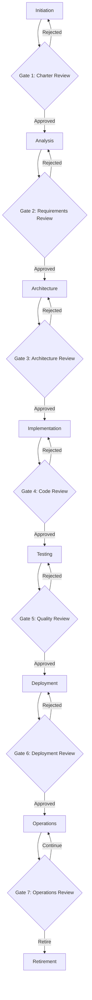

# Software Development Lifecycle (SDLC)

## Overview

This section defines our phased, gate-based SDLC with mandatory human reviews at critical decision points. The process emphasizes interface-first design to establish solid architectural foundations before implementation begins.

## Core Principles

1. **Gate-Based Progression**: Each phase requires explicit approval to proceed
2. **Human Review Mandatory**: Critical decisions require human evaluation and sign-off
3. **Interface-First**: Define contracts and APIs before implementation
4. **Traceability**: Full audit trail of decisions and approvals
5. **Risk Mitigation**: Early identification and resolution of issues

## SDLC Framework Structure

### Phases

1. [**Initiation**](./phases/01-initiation.md) - Project inception and charter
2. [**Analysis**](./phases/02-analysis.md) - Requirements gathering and analysis
3. [**Architecture**](./phases/03-architecture.md) - System design and interface definition
4. [**Implementation**](./phases/04-implementation.md) - Code development and integration
5. [**Testing**](./phases/05-testing.md) - Quality assurance and validation
6. [**Deployment**](./phases/06-deployment.md) - Production release and go-live
7. [**Operations**](./phases/07-operations.md) - Maintenance and monitoring
8. [**Retirement**](./phases/08-retirement.md) - End-of-life and decommissioning

### Gates

Each phase concludes with a formal gate review:

- [**Gate Reviews**](./gates/README.md) - Approval criteria and processes
- [**Review Templates**](./reviews/README.md) - Standardized evaluation forms

## Quick Navigation

| Phase              | Purpose                                 | Key Deliverables                                | Gate Criteria                     |
| ------------------ | --------------------------------------- | ----------------------------------------------- | --------------------------------- |
| **Initiation**     | Define project scope and objectives     | Project Charter, Stakeholder Analysis           | Business case approved            |
| **Analysis**       | Understand requirements and constraints | Requirements Specification, Risk Assessment     | Requirements baseline established |
| **Architecture**   | Design system structure and interfaces  | Architecture Document, Interface Specifications | Technical approach approved       |
| **Implementation** | Build and integrate system components   | Source Code, Unit Tests, Integration Tests      | Code quality standards met        |
| **Testing**        | Validate system meets requirements      | Test Plans, Test Results, Defect Reports        | Quality gates satisfied           |
| **Deployment**     | Release system to production            | Deployment Guide, Runbooks, Monitoring Setup    | Production readiness confirmed    |
| **Operations**     | Maintain and enhance system             | Performance Reports, Change Requests            | Service levels maintained         |
| **Retirement**     | Safely decommission system              | Migration Plan, Data Archive, Documentation     | Sunset plan executed              |

## Gate-Based Process Flow

## Human Review Requirements

### Mandatory Reviews

- **Architecture Review Board**: Technical architecture decisions
- **Security Review Board**: Security and compliance assessments
- **Change Advisory Board**: Production changes and deployments
- **Quality Assurance**: Testing and quality validation
- **Business Stakeholders**: Requirements and business value

### Review Composition

Each review board must include:

- **Subject Matter Experts**: Technical domain expertise
- **Security Representative**: Security and compliance perspective
- **Operations Representative**: Operational feasibility and support
- **Business Representative**: Business value and requirements alignment
- **Quality Representative**: Quality standards and testing approach

## Interface-First Design

### Principle

Before any implementation begins, all system interfaces must be fully defined and approved. This includes:

1. **API Specifications**: RESTful APIs, GraphQL schemas, messaging contracts
2. **Data Models**: Database schemas, data transfer objects, event structures
3. **Integration Points**: External system interfaces, third-party APIs
4. **User Interfaces**: UI mockups, user experience flows, accessibility requirements

### Benefits

- **Early Validation**: Catch design issues before implementation
- **Parallel Development**: Teams can work independently against agreed interfaces
- **Testing Strategy**: Enable comprehensive testing planning
- **Risk Reduction**: Minimize integration and compatibility issues

### Enforcement

- Architecture gate requires complete interface specifications
- Implementation cannot begin without approved interface contracts
- Changes to interfaces require architecture review board approval
- Interface versioning strategy must be defined upfront

## Compliance Integration

This SDLC framework integrates with:

- [Security practices](../security/README.md)
- [Compliance requirements](../compliance/README.md)
- [Testing frameworks](../testing/README.md)
- [CI/CD processes](../ci-cd/README.md)
- [Governance structures](../governance/README.md)

---

_Refer to individual phase and gate documentation for detailed implementation guidance._
