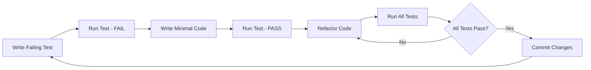

# Testing Framework

## Overview

This comprehensive testing framework covers Test-Driven Development (TDD), fuzz testing, performance testing, and quality assurance practices integrated throughout the SDLC. It emphasizes early testing, automated validation, and continuous quality improvement.

## Testing Philosophy

### Core Principles

1. **Shift Left**: Test early and often in the development cycle
2. **Test-Driven Development**: Write tests before writing code
3. **Automation First**: Automate repetitive testing activities
4. **Risk-Based Testing**: Focus testing on high-risk areas
5. **Continuous Testing**: Integrate testing into CI/CD pipelines
6. **Quality Built In**: Quality is everyone's responsibility

### Testing Types

- [**TDD (Test-Driven Development)**](./tdd/README.md) - Test-first development approach
- [**Fuzz Testing**](./fuzzing/README.md) - Random input validation and security testing
- [**Performance Testing**](./performance/README.md) - Load, stress, and scalability testing
- [**Security Testing**](./security-testing.md) - Vulnerability and penetration testing
- [**Accessibility Testing**](./accessibility-testing.md) - A11y compliance validation

## Testing Pyramid

```
    /\     Manual/Exploratory Testing (10%)
   /  \
  /____\   Integration/API Testing (20%)
 /______\
/_________\ Unit Testing (70%)
```

### Testing Levels

1. **Unit Tests (70%)**: Fast, isolated, developer-focused
2. **Integration Tests (20%)**: Component interaction validation
3. **System Tests (7%)**: End-to-end functionality validation
4. **Exploratory Tests (3%)**: Human-driven discovery testing

## Test-Driven Development (TDD)

### TDD Cycle (Red-Green-Refactor)

1. **Red**: Write a failing test that defines desired functionality
2. **Green**: Write minimal code to make the test pass
3. **Refactor**: Improve code quality while keeping tests green

### TDD Process



### TDD Benefits

- **Design Quality**: Forces thinking about design before implementation
- **Test Coverage**: Ensures high test coverage from the start
- **Regression Safety**: Prevents breaking existing functionality
- **Documentation**: Tests serve as living documentation
- **Confidence**: Developers can refactor with confidence

### TDD Implementation Guidelines

#### Unit Test Structure (AAA Pattern)

```python
def test_user_registration():
    # Arrange - Set up test data and conditions
    user_data = {
        'username': 'testuser',
        'email': 'test@example.com',
        'password': 'secure_password123'
    }

    # Act - Execute the functionality being tested
    result = user_service.register_user(user_data)

    # Assert - Verify the expected outcome
    assert result.success is True
    assert result.user.username == 'testuser'
    assert result.user.email == 'test@example.com'
```

#### Test Naming Convention

- **Given_When_Then**: `given_invalid_email_when_registering_then_returns_error`
- **Should_When**: `should_return_error_when_email_is_invalid`
- **Descriptive**: `user_registration_fails_with_invalid_email`

#### Test Organization

```
tests/
├── unit/
│   ├── services/
│   ├── models/
│   └── utils/
├── integration/
│   ├── api/
│   ├── database/
│   └── external_services/
├── e2e/
│   ├── user_journeys/
│   └── critical_paths/
└── fixtures/
    ├── data/
    └── mocks/
```

### TDD Metrics

- **Test Coverage**: Target >90% line coverage, >80% branch coverage
- **Test Execution Time**: Unit tests <10ms each, full suite <5 minutes
- **Test Reliability**: <1% flaky test rate
- **Test Maintenance**: <10% of development time spent on test maintenance

## Fuzz Testing Framework

### Fuzzing Types

1. **Black Box Fuzzing**: No knowledge of internal structure
2. **White Box Fuzzing**: Full knowledge of implementation
3. **Grey Box Fuzzing**: Partial knowledge with feedback

### Fuzzing Strategies

- **Random Fuzzing**: Completely random input generation
- **Mutation-Based**: Modify valid inputs to create test cases
- **Generation-Based**: Create inputs based on format specifications
- **Grammar-Based**: Use formal grammars to generate structured inputs

### Fuzzing Tools and Integration

```yaml
fuzzing_pipeline:
  api_fuzzing:
    tool: RESTler
    target: api_endpoints
    duration: 24h
    schedule: nightly

  web_fuzzing:
    tool: OWASP_ZAP
    target: web_application
    duration: 4h
    schedule: weekly

  binary_fuzzing:
    tool: AFL++
    target: native_binaries
    duration: 72h
    schedule: weekly

  protocol_fuzzing:
    tool: Peach_Fuzzer
    target: network_protocols
    duration: 12h
    schedule: bi-weekly
```

### Fuzz Testing Process

1. **Target Identification**: Identify components to fuzz
2. **Input Generation**: Create or mutate test inputs
3. **Execution**: Run target with fuzzed inputs
4. **Monitoring**: Observe crashes, hangs, or anomalies
5. **Triage**: Analyze failures and create reproducible test cases
6. **Reporting**: Document vulnerabilities and create fixes

## Performance Testing Framework

### Performance Testing Types

1. **Load Testing**: Normal expected load conditions
2. **Stress Testing**: Beyond normal capacity until breaking point
3. **Spike Testing**: Sudden load increases
4. **Volume Testing**: Large amounts of data
5. **Endurance Testing**: Extended periods of load

### Performance Test Strategy

```yaml
performance_testing:
  load_test:
    users: 1000
    duration: 30m
    ramp_up: 5m
    think_time: 1-3s

  stress_test:
    users: 5000
    duration: 15m
    ramp_up: 10m
    breaking_point: true

  spike_test:
    normal_load: 100
    spike_load: 2000
    spike_duration: 2m
    recovery_time: 5m
```

### Performance Metrics

| Metric                   | Target    | Critical |
| ------------------------ | --------- | -------- |
| **Response Time**        | <200ms    | <500ms   |
| **Throughput**           | >1000 TPS | >500 TPS |
| **Error Rate**           | <0.1%     | <1%      |
| **CPU Utilization**      | <70%      | <85%     |
| **Memory Usage**         | <80%      | <90%     |
| **Database Connections** | <80%      | <95%     |

### Performance Testing Tools

- **Load Testing**: JMeter, K6, Gatling, LoadRunner
- **APM Tools**: New Relic, Datadog, AppDynamics
- **Profiling**: Java Flight Recorder, Python cProfile, Go pprof
- **Database**: pgbench, sysbench, HammerDB

## Security Testing Integration

### Security Test Types

1. **SAST (Static)**: Code vulnerability analysis
2. **DAST (Dynamic)**: Runtime security testing
3. **IAST (Interactive)**: Real-time vulnerability detection
4. **SCA (Composition)**: Third-party component analysis

### Security Testing Pipeline

```yaml
security_testing:
  static_analysis:
    tools: [semgrep, sonarqube, checkmarx]
    triggers: [commit, pr, nightly]

  dynamic_analysis:
    tools: [owasp_zap, burp_suite]
    environment: staging
    schedule: weekly

  dependency_scanning:
    tools: [safety, retire.js, bundler-audit]
    triggers: [dependency_update, weekly]

  container_scanning:
    tools: [clair, twistlock, aqua]
    triggers: [image_build, deployment]
```

## Quality Assurance Framework

### Quality Gates

Each SDLC phase includes quality gates with specific criteria:

| Phase              | Quality Gate         | Criteria                                 |
| ------------------ | -------------------- | ---------------------------------------- |
| **Implementation** | Code Quality Gate    | Code coverage >80%, No critical issues   |
| **Testing**        | Test Quality Gate    | All tests pass, Performance targets met  |
| **Deployment**     | Release Quality Gate | Security scan pass, Load test validation |

### Defect Management

1. **Defect Classification**
   - **Critical**: System crash, data loss, security vulnerability
   - **High**: Major functionality broken, performance degradation
   - **Medium**: Minor functionality issues, usability problems
   - **Low**: Cosmetic issues, documentation errors

2. **Defect Lifecycle**
   - New → Assigned → In Progress → Resolved → Verified → Closed

3. **Defect Metrics**
   - Defect Detection Rate: Defects found per testing hour
   - Defect Removal Efficiency: (Defects found in testing / Total defects) × 100
   - Defect Leakage: Defects found in production / Total defects

### Test Automation Strategy

#### Automation Framework

```python
# Example test automation structure
class TestAutomationFramework:
    def __init__(self):
        self.config = TestConfig()
        self.data_manager = TestDataManager()
        self.reporter = TestReporter()

    def run_test_suite(self, suite_name):
        results = []
        for test in self.get_tests(suite_name):
            result = self.execute_test(test)
            results.append(result)
        return self.reporter.generate_report(results)
```

#### CI/CD Integration

```yaml
# Example GitHub Actions workflow
name: Quality Assurance Pipeline
on: [push, pull_request]

jobs:
  unit-tests:
    runs-on: ubuntu-latest
    steps:
      - uses: actions/checkout@v3
      - name: Run Unit Tests
        run: pytest tests/unit --cov=src --cov-report=xml

  integration-tests:
    runs-on: ubuntu-latest
    needs: unit-tests
    steps:
      - uses: actions/checkout@v3
      - name: Run Integration Tests
        run: pytest tests/integration

  performance-tests:
    runs-on: ubuntu-latest
    needs: integration-tests
    steps:
      - name: Run Load Tests
        run: k6 run tests/performance/load-test.js
```

## Test Environment Management

### Environment Types

1. **Development**: Individual developer environments
2. **Testing**: Dedicated testing environment with production-like data
3. **Staging**: Pre-production environment identical to production
4. **Production**: Live environment serving real users

### Environment Consistency

- **Infrastructure as Code**: Terraform, CloudFormation, Pulumi
- **Configuration Management**: Ansible, Chef, Puppet
- **Containerization**: Docker, Kubernetes for consistent deployments
- **Test Data Management**: Synthetic data generation, data masking

## Continuous Improvement

### Testing Metrics Dashboard

- Test execution trends and success rates
- Code coverage trends over time
- Defect discovery and resolution rates
- Test automation coverage and effectiveness
- Performance benchmark trends

### Retrospectives and Learning

- Monthly testing retrospectives
- Post-incident testing analysis
- Best practice sharing across teams
- Tool evaluation and adoption
- Training and skill development

---

_Quality is not an act, it is a habit. Our testing framework ensures that quality is built into every aspect of the development process._
