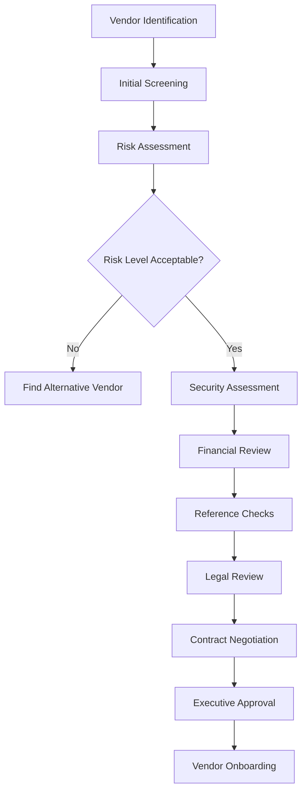

# Vendor and Third-Party Management

## Overview

This framework provides comprehensive guidance for managing vendor relationships, open source software (OSS) compliance, and third-party risk throughout the software development lifecycle.

## Management Philosophy

### Core Principles

1. **Risk-Based Assessment**: Evaluate vendors based on potential impact and risk
2. **Due Diligence**: Thorough evaluation before engagement and ongoing monitoring
3. **Contract Governance**: Clear terms, SLAs, and exit clauses in all agreements
4. **Continuous Monitoring**: Regular assessment of vendor performance and security posture
5. **Strategic Partnership**: Foster collaborative relationships with key vendors

### Framework Components

- [**OSS Management**](./oss/README.md) - Open source software governance
- [**Third-Party Risk**](./third-party/README.md) - Vendor risk assessment and management
- [**Contract Management**](./contracts/README.md) - Legal and commercial governance
- [**Vendor Lifecycle**](./lifecycle/README.md) - End-to-end vendor relationship management

## Open Source Software (OSS) Management

### OSS Governance Framework

```yaml
oss_governance:
  policy_objectives:
    - ensure_license_compliance
    - manage_security_vulnerabilities
    - control_technical_debt
    - maintain_legal_defensibility
    - optimize_cost_and_value

  approval_process:
    automated_approval:
      licenses: [MIT, Apache-2.0, BSD-3-Clause]
      security_criteria: no_critical_vulnerabilities
      maintenance_status: actively_maintained

    manual_review:
      licenses: [GPL, LGPL, AGPL, Custom]
      security_criteria: known_vulnerabilities_present
      maintenance_status: abandoned_or_deprecated

    prohibited:
      licenses: [WTFPL, Unlicense, Unknown]
      security_criteria: critical_unpatched_vulnerabilities
      legal_status: patent_encumbered
```

### License Management

```yaml
license_categories:
  permissive:
    examples: [MIT, Apache-2.0, BSD-2-Clause, BSD-3-Clause]
    restrictions: minimal
    commercial_use: allowed
    copyleft: no
    approval: automatic

  weak_copyleft:
    examples: [LGPL-2.1, LGPL-3.0, MPL-2.0]
    restrictions: library_changes_must_be_shared
    commercial_use: allowed
    copyleft: limited
    approval: legal_review

  strong_copyleft:
    examples: [GPL-2.0, GPL-3.0, AGPL-3.0]
    restrictions: derivative_works_must_be_shared
    commercial_use: restricted
    copyleft: full
    approval: executive_decision

  proprietary:
    examples: [Commercial licenses, Custom licenses]
    restrictions: per_license_terms
    commercial_use: per_agreement
    copyleft: varies
    approval: legal_and_procurement
```

### OSS Security Management

```yaml
security_scanning:
  vulnerability_detection:
    tools: [Snyk, WhiteSource, Sonatype, GitHub_Security_Advisories]
    frequency: continuous
    thresholds:
      critical: immediate_action_required
      high: remediation_within_7_days
      medium: remediation_within_30_days

  supply_chain_security:
    package_verification: cryptographic_signatures
    source_validation: trusted_repositories_only
    dependency_pinning: exact_version_specification
    update_strategy: automated_with_security_exceptions

  compliance_tracking:
    sbom_generation: automated_software_bill_of_materials
    license_inventory: comprehensive_license_tracking
    usage_monitoring: runtime_component_analysis
```

### OSS Contribution Guidelines

```yaml
contribution_policy:
  approval_required_for:
    - creating_new_oss_projects
    - contributing_to_external_projects
    - releasing_internal_code_as_oss

  contribution_process:
    1_business_justification: value_and_strategic_alignment
    2_legal_review: ip_clearance_and_license_compatibility
    3_security_review: no_proprietary_information_disclosure
    4_technical_review: code_quality_and_maintainability
    5_ongoing_maintenance: commitment_to_long_term_support

  prohibited_contributions:
    - proprietary_algorithms_or_business_logic
    - customer_data_or_personal_information
    - security_vulnerabilities_or_exploits
    - patent_encumbered_code
```

## Third-Party Risk Management

### Vendor Risk Assessment Framework

```yaml
risk_assessment:
  risk_categories:
    operational_risk:
      factors: [service_availability, performance, scalability]
      impact: business_operations_disruption
      mitigation: sla_enforcement + backup_vendors

    security_risk:
      factors: [data_access, security_controls, incident_history]
      impact: data_breach_or_system_compromise
      mitigation: security_audits + contractual_controls

    financial_risk:
      factors: [vendor_stability, payment_terms, cost_escalation]
      impact: service_disruption_or_cost_overruns
      mitigation: financial_health_monitoring + escrow

    compliance_risk:
      factors: [regulatory_compliance, audit_results, certifications]
      impact: regulatory_violations_or_fines
      mitigation: compliance_audits + contractual_warranties

    concentration_risk:
      factors: [dependency_level, switching_costs, alternatives]
      impact: vendor_lock_in_or_single_point_of_failure
      mitigation: multi_vendor_strategy + exit_planning
```

### Vendor Classification

| Tier           | Criteria                                             | Assessment Frequency | Requirements                        |
| -------------- | ---------------------------------------------------- | -------------------- | ----------------------------------- |
| **Critical**   | Business critical services, access to sensitive data | Quarterly            | Full audit, SOC2, insurance, escrow |
| **Important**  | Significant operational impact, customer-facing      | Semi-annually        | Security assessment, insurance      |
| **Standard**   | Limited impact, internal use                         | Annually             | Basic security questionnaire        |
| **Low Impact** | Minimal risk, easily replaceable                     | Bi-annually          | Vendor agreement only               |

### Due Diligence Process



### Ongoing Vendor Monitoring

```yaml
monitoring_framework:
  performance_monitoring:
    metrics: [sla_compliance, incident_frequency, response_times]
    reporting: monthly_scorecards
    escalation: performance_improvement_plans

  security_monitoring:
    activities: [security_questionnaires, audit_reports, certification_updates]
    frequency: based_on_risk_tier
    tools: [security_ratings, threat_intelligence, news_monitoring]

  financial_monitoring:
    indicators: [credit_ratings, financial_statements, market_news]
    frequency: quarterly_for_critical_vendors
    alerts: financial_distress_indicators

  compliance_monitoring:
    requirements: [certification_maintenance, audit_results, regulatory_updates]
    validation: annual_compliance_attestation
    reporting: compliance_dashboard_updates
```

## Contract Management

### Contract Framework

```yaml
contract_structure:
  standard_clauses:
    service_levels:
      - availability_guarantees
      - performance_standards
      - support_response_times
      - penalty_clauses

    security_requirements:
      - data_protection_standards
      - security_incident_notification
      - audit_rights_and_access
      - security_control_requirements

    compliance_obligations:
      - regulatory_compliance_warranties
      - certification_maintenance_requirements
      - audit_cooperation_clauses
      - data_residency_requirements

    risk_management:
      - liability_limitations
      - insurance_requirements
      - indemnification_clauses
      - force_majeure_provisions

    business_continuity:
      - backup_and_disaster_recovery
      - business_continuity_planning
      - service_transition_assistance
      - data_portability_rights
```

### Contract Lifecycle Management

1. **Requirements Definition**: Document business and technical requirements
2. **Vendor Selection**: Competitive evaluation and selection process
3. **Contract Negotiation**: Terms, pricing, and risk allocation
4. **Legal Review**: Contract approval and risk assessment
5. **Contract Execution**: Signing and formal agreement establishment
6. **Implementation**: Service implementation and integration
7. **Performance Management**: Ongoing monitoring and relationship management
8. **Contract Renewal/Termination**: Evaluate continuation or transition

### Exit Strategy Planning

```yaml
exit_planning:
  transition_requirements:
    data_extraction: complete_data_export_in_standard_formats
    knowledge_transfer: documentation_and_training_materials
    service_continuity: overlap_period_with_new_vendor
    intellectual_property: return_of_proprietary_information

  timeline_planning:
    notification_period: 90_days_minimum
    transition_period: 30-180_days_depending_on_complexity
    parallel_running: 30_days_validation_period
    final_cutover: coordinated_switchover_with_minimal_downtime

  cost_management:
    termination_fees: negotiate_reasonable_early_termination_costs
    transition_costs: budget_for_migration_and_integration
    dual_running_costs: account_for_overlap_period_expenses
    opportunity_costs: factor_in_business_impact_during_transition
```

## Vendor Relationship Management

### Vendor Governance Structure

```yaml
governance_roles:
  vendor_management_office:
    responsibilities: [policy_development, process_standardization, vendor_oversight]
    authority: enterprise_vendor_strategy

  business_relationship_managers:
    responsibilities: [day_to_day_relationship, performance_management, issue_resolution]
    authority: operational_vendor_decisions

  procurement_team:
    responsibilities: [contract_negotiation, cost_management, compliance]
    authority: commercial_terms_and_conditions

  technical_teams:
    responsibilities: [integration, security_assessment, technical_evaluation]
    authority: technical_requirements_and_architecture
```

### Vendor Performance Management

```yaml
performance_framework:
  kpi_categories:
    service_delivery:
      - availability_percentage: target_99.9%
      - response_times: within_agreed_slas
      - incident_resolution: mttr_targets
      - customer_satisfaction: quarterly_surveys

    business_impact:
      - cost_effectiveness: value_for_money_assessment
      - innovation_contribution: new_capabilities_delivered
      - strategic_alignment: business_objective_support
      - risk_mitigation: risk_reduction_achievements

  performance_reviews:
    frequency: quarterly_business_reviews
    participants: [business_stakeholders, vendor_executives, technical_leads]
    agenda: [performance_review, roadmap_discussion, issue_resolution]
    outcomes: [action_items, relationship_health_score, contract_adjustments]
```

### Vendor Development Programs

- **Strategic Partner Program**: Deep collaboration with key technology vendors
- **Innovation Partnerships**: Joint development and research initiatives
- **Preferred Vendor Program**: Streamlined procurement for proven vendors
- **Diversity and Inclusion**: Support for minority and women-owned businesses
- **Sustainability Program**: Environmental and social responsibility criteria

## Risk Mitigation Strategies

### Multi-Vendor Strategies

```yaml
diversification_approaches:
  best_of_breed:
    strategy: select_best_solution_per_function
    benefits: [optimal_functionality, vendor_competition]
    challenges: [integration_complexity, management_overhead]

  vendor_consolidation:
    strategy: minimize_number_of_vendors
    benefits: [simplified_management, better_negotiating_power]
    challenges: [concentration_risk, potential_vendor_lock_in]

  hybrid_approach:
    strategy: balance_between_consolidation_and_diversification
    benefits: [risk_balance, operational_efficiency]
    challenges: [complexity_management, optimization_trade_offs]
```

### Contingency Planning

1. **Alternative Vendor Identification**: Maintain list of approved backup vendors
2. **Service Substitution Plans**: Document how to replace critical services
3. **Data Portability**: Ensure data can be extracted and migrated
4. **Service Level Degradation**: Plans for operating with reduced functionality
5. **Emergency Procurement**: Expedited processes for critical situations

## Compliance and Audit

### Vendor Compliance Framework

```yaml
compliance_requirements:
  mandatory_certifications:
    security: [SOC2_Type_II, ISO27001, PCI_DSS]
    privacy: [GDPR_compliance, privacy_shield_equivalent]
    industry_specific: [HIPAA, FedRAMP, varies_by_sector]

  audit_requirements:
    frequency: annual_for_critical_vendors
    scope: [security_controls, operational_processes, financial_health]
    conducted_by: [internal_audit, third_party_auditors, vendor_self_assessment]

  documentation_requirements:
    policies_and_procedures: vendor_security_and_operational_policies
    incident_reports: security_and_operational_incident_documentation
    certification_evidence: current_compliance_certifications
    insurance_documentation: liability_and_cyber_insurance_proof
```

### Vendor Audit Process

1. **Audit Planning**: Define scope, objectives, and timeline
2. **Information Gathering**: Collect documentation and evidence
3. **On-site/Virtual Assessment**: Review processes and controls
4. **Gap Analysis**: Identify compliance gaps and risks
5. **Remediation Planning**: Develop action plans for identified issues
6. **Follow-up**: Monitor remediation progress and validate completion

---

_Effective vendor management is about building strategic partnerships that drive business value while managing risk and ensuring compliance._
