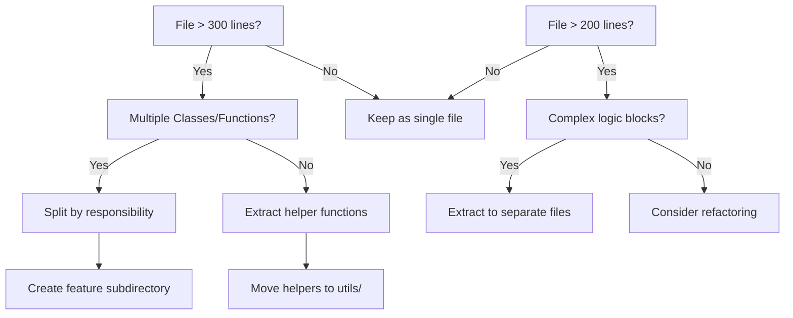
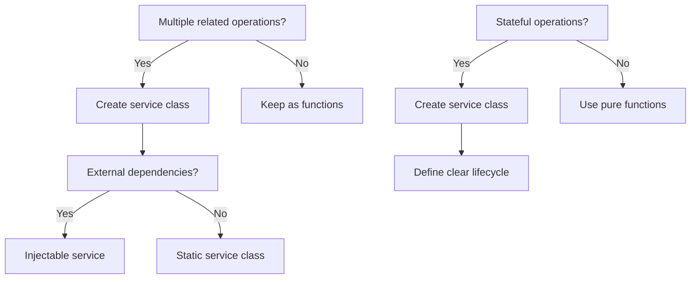
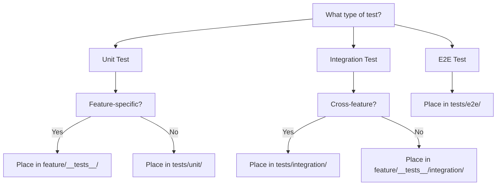
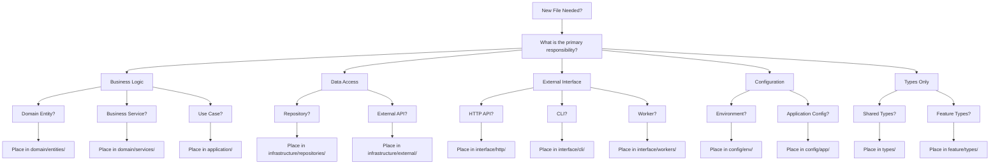

# Real-World TypeScript Project Structure — a Practical, Battle-Tested Guide

Below is an opinionated, production-grade blueprint you can lift into new or existing codebases. It scales from single-package libraries to large monorepos, keeps builds fast with Project References, and bakes in TDD and OWASP-aligned hygiene from day one.

---

## 0) Design goals (why this layout works)

### Core Architectural Principles

- **Feature-based organization**: Group related functionality together to minimize cognitive overhead and enable parallel development.
- **Type isolation**: Separate types from implementation to prevent circular dependencies and enable clean interfaces.
- **Small file sizes**: Target 100-200 lines per file (max 300) for better readability, maintainability, and faster IDE performance.
- **Consistent naming**: Predictable file and directory naming conventions that eliminate guesswork.
- **Separation of concerns**: domain ↔ application ↔ infrastructure ↔ interface layers with clear boundaries.
- **Fast, incremental builds**: TypeScript Project References + strict `tsconfig` baselines. ([typescriptlang.org][1])
- **Predictable imports**: `baseUrl`/`paths` for stable, refactor-friendly module specifiers. ([typescriptlang.org][2])
- **Testability**: first-class tests with clear boundaries, fixtures, and truth-tables (`it.each`).
- **Security**: OWASP checklists wired into linting, config, and CI. ([OWASP Foundation][3])
- **Ergonomics**: editor/CI scripts that fail fast (types → lint → tests → build).

### Decision Matrix for File Organization

**When to create a new directory:**

- 3+ related files
- Distinct bounded context/domain
- Different layer responsibilities
- Reusable component grouping

**When to split a file:**

- \>300 lines of code
- Multiple responsibilities/concerns
- \>5 exported items
- Complex conditional logic blocks

**When to separate types:**

- Shared across multiple modules
- Complex domain models (\>5 properties)
- API contracts/DTOs
- Generic/utility types

---

## 1) Pick the right shape

### A) Small library (single package)

```text
my-lib/
├─ src/
│  ├─ index.ts                # Public API surface (barrel of *explicit* exports)
│  ├─ types/                  # Shared type definitions
│  │  ├─ index.ts             # Type barrel exports
│  │  ├─ common.types.ts      # Cross-cutting types (<100 lines)
│  │  └─ api.types.ts         # API contracts and DTOs
│  ├─ core/                   # Pure business logic (no side effects)
│  │  ├─ index.ts             # Core barrel exports
│  │  └─ validators/          # Input validation logic
│  │     ├─ index.ts
│  │     ├─ schema.validator.ts
│  │     └─ schema.validator.types.ts
│  ├─ features/               # Feature-based organization
│  │  └─ user-management/     # Each feature is self-contained
│  │     ├─ index.ts          # Feature barrel exports
│  │     ├─ user.ts           # Core implementation (<200 lines)
│  │     ├─ user.types.ts     # Feature-specific types
│  │     ├─ user.service.ts   # Business logic layer
│  │     ├─ user.factory.ts   # Object creation patterns
│  │     └─ __tests__/        # Feature-scoped tests
│  │        ├─ user.test.ts
│  │        └─ user.service.test.ts
│  ├─ utils/                  # Pure utility functions
│  │  ├─ index.ts             # Utility barrel exports
│  │  ├─ date.utils.ts        # Date manipulation helpers
│  │  ├─ string.utils.ts      # String processing helpers
│  │  └─ validation.utils.ts  # Validation helper functions
│  └─ internal/               # Non-exported modules (no barrels)
│     └─ helpers/             # Private implementation details
├─ tests/                     # Integration and E2E tests
│  ├─ fixtures/               # Test data and mocks
│  ├─ integration/            # Cross-feature integration tests
│  └─ unit/                   # Additional unit tests if needed
├─ tsconfig.json              # extends ./tsconfig.base.json
├─ tsconfig.base.json         # strictness, module+target
├─ package.json               # "types": "./dist/index.d.ts"
├─ eslint.config.js
├─ vitest.config.ts           # or jest.config.ts
└─ dist/                      # build output (gitignored)
```

#### File Organization Rules for Small Libraries

##### Public API Design

- **Single barrel entry** (`src/index.ts`) with **explicit exports** only
- **No wildcard re-exports** of internals to prevent API surface bloat
- **Type-first exports** - types before implementations in barrel files

##### Feature-Based Organization

- Group related functionality in feature directories (e.g., `user-management/`)
- Each feature contains: implementation, types, services, factories, tests
- **Feature completeness**: A feature should be removable by deleting its directory

##### Type Separation Strategy

- **Centralized types** (`src/types/`) for cross-cutting concerns
- **Feature-local types** (`.types.ts` suffix) for domain-specific models
- **API types** separate from internal types to enable versioning
- **Generic types** in dedicated files for reusability

##### File Size Guidelines

- **Core implementations**: Target 150-200 lines, max 300
- **Type files**: Target 50-100 lines, max 150
- **Service files**: Target 100-200 lines, split at 250+
- **Test files**: No strict limit, but group related tests

##### Naming Conventions

- **Implementation files**: `user.ts`, `payment-processor.ts`
- **Type files**: `user.types.ts`, `api.types.ts`
- **Service files**: `user.service.ts`, `notification.service.ts`
- **Factory files**: `user.factory.ts`, `config.factory.ts`
- **Utility files**: `date.utils.ts`, `validation.utils.ts`
- **Test files**: `user.test.ts`, `integration.test.ts`

**Key rules**

- One **public barrel** (`src/index.ts`) with **explicit exports** only—no “wildcard re-exports” of internals.
- `internal/` for helpers you don’t want consumers importing.
- Tests live in `/tests` (or `src/**/__tests__`) to keep `/src` clean; they import the public API.

### B) Service/API (hexagonal layering)

```text
my-service/
├─ src/
│  ├─ types/                  # Shared type definitions across layers
│  │  ├─ index.ts             # Type barrel exports
│  │  ├─ common.types.ts      # Cross-cutting types
│  │  ├─ domain.types.ts      # Domain model types
│  │  ├─ api.types.ts         # API request/response types
│  │  └─ infrastructure.types.ts # Infrastructure contract types
│  ├─ domain/                 # Pure business logic (no dependencies)
│  │  ├─ entities/            # Domain entities with business rules
│  │  │  ├─ index.ts
│  │  │  ├─ user.entity.ts    # User aggregate root
│  │  │  ├─ user.entity.types.ts
│  │  │  ├─ order.entity.ts   # Order aggregate root
│  │  │  └─ order.entity.types.ts
│  │  ├─ value-objects/       # Immutable value objects
│  │  │  ├─ index.ts
│  │  │  ├─ email.vo.ts       # Email value object
│  │  │  ├─ money.vo.ts       # Money value object
│  │  │  └─ address.vo.ts     # Address value object
│  │  ├─ services/            # Domain services (business logic)
│  │  │  ├─ index.ts
│  │  │  ├─ user-registration.service.ts
│  │  │  ├─ pricing.service.ts
│  │  │  └─ inventory.service.ts
│  │  └─ events/              # Domain events
│  │     ├─ index.ts
│  │     ├─ user-created.event.ts
│  │     └─ order-placed.event.ts
│  ├─ application/            # Use cases and orchestration (pure, IO-free)
│  │  ├─ commands/            # Command handlers (write operations)
│  │  │  ├─ index.ts
│  │  │  ├─ create-user/      # Feature-grouped command
│  │  │  │  ├─ create-user.command.ts
│  │  │  │  ├─ create-user.handler.ts
│  │  │  │  └─ create-user.types.ts
│  │  │  └─ place-order/
│  │  │     ├─ place-order.command.ts
│  │  │     ├─ place-order.handler.ts
│  │  │     └─ place-order.types.ts
│  │  ├─ queries/             # Query handlers (read operations)
│  │  │  ├─ index.ts
│  │  │  ├─ get-user/
│  │  │  │  ├─ get-user.query.ts
│  │  │  │  ├─ get-user.handler.ts
│  │  │  │  └─ get-user.types.ts
│  │  │  └─ list-orders/
│  │  │     ├─ list-orders.query.ts
│  │  │     ├─ list-orders.handler.ts
│  │  │     └─ list-orders.types.ts
│  │  ├─ services/            # Application services (orchestration)
│  │  │  ├─ index.ts
│  │  │  ├─ user-orchestration.service.ts
│  │  │  └─ order-orchestration.service.ts
│  │  └─ ports/               # Interface definitions (dependency inversion)
│  │     ├─ index.ts
│  │     ├─ repositories/     # Repository interfaces
│  │     │  ├─ user.repository.ts
│  │     │  └─ order.repository.ts
│  │     ├─ external/         # External service interfaces
│  │     │  ├─ payment.service.ts
│  │     │  └─ notification.service.ts
│  │     └─ infrastructure/   # Infrastructure interfaces
│  │        ├─ logger.ts
│  │        └─ cache.ts
│  ├─ infrastructure/         # External adapters and implementations
│  │  ├─ database/            # Database adapters
│  │  │  ├─ repositories/     # Repository implementations
│  │  │  │  ├─ index.ts
│  │  │  │  ├─ postgres-user.repository.ts
│  │  │  │  └─ postgres-order.repository.ts
│  │  │  ├─ migrations/       # Database migrations
│  │  │  └─ schemas/          # Database schemas
│  │  ├─ external-services/   # External service adapters
│  │  │  ├─ payment/
│  │  │  │  ├─ stripe-payment.service.ts
│  │  │  │  └─ stripe-payment.types.ts
│  │  │  └─ notifications/
│  │  │     ├─ email-notification.service.ts
│  │  │     └─ sms-notification.service.ts
│  │  ├─ messaging/           # Message queue adapters
│  │  │  ├─ event-bus.ts
│  │  │  └─ rabbit-mq.adapter.ts
│  │  └─ cross-cutting/       # Infrastructure concerns
│  │     ├─ logging/
│  │     │  ├─ winston.logger.ts
│  │     │  └─ structured.logger.ts
│  │     ├─ caching/
│  │     │  ├─ redis.cache.ts
│  │     │  └─ memory.cache.ts
│  │     └─ monitoring/
│  │        ├─ metrics.service.ts
│  │        └─ health-check.service.ts
│  ├─ interface/              # External interfaces (inbound adapters)
│  │  ├─ http/                # HTTP API interface
│  │  │  ├─ controllers/      # HTTP controllers
│  │  │  │  ├─ index.ts
│  │  │  │  ├─ users/         # Feature-grouped controllers
│  │  │  │  │  ├─ users.controller.ts
│  │  │  │  │  ├─ users.controller.types.ts
│  │  │  │  │  └─ users.routes.ts
│  │  │  │  └─ orders/
│  │  │  │     ├─ orders.controller.ts
│  │  │  │     ├─ orders.controller.types.ts
│  │  │  │     └─ orders.routes.ts
│  │  │  ├─ middleware/       # HTTP middleware
│  │  │  │  ├─ auth.middleware.ts
│  │  │  │  ├─ validation.middleware.ts
│  │  │  │  └─ error.middleware.ts
│  │  │  └─ server.ts         # HTTP server setup
│  │  ├─ cli/                 # Command-line interface
│  │  │  ├─ commands/         # CLI command implementations
│  │  │  │  ├─ migrate.command.ts
│  │  │  │  └─ seed.command.ts
│  │  │  └─ cli.ts            # CLI setup and routing
│  │  └─ workers/             # Background job processors
│  │     ├─ email-worker.ts
│  │     └─ report-worker.ts
│  ├─ config/                 # Configuration and environment
│  │  ├─ index.ts             # Configuration barrel
│  │  ├─ env.config.ts        # Environment variable parsing
│  │  ├─ database.config.ts   # Database configuration
│  │  └─ app.config.ts        # Application configuration
│  └─ index.ts                # Composition root (DI container setup)
├─ tests/
│  ├─ unit/                   # Unit tests (domain & application)
│  │  ├─ domain/              # Domain layer tests
│  │  │  ├─ entities/
│  │  │  ├─ value-objects/
│  │  │  └─ services/
│  │  └─ application/         # Application layer tests
│  │     ├─ commands/
│  │     ├─ queries/
│  │     └─ services/
│  ├─ integration/            # Integration tests
│  │  ├─ database/            # Database integration tests
│  │  ├─ external-services/   # External service integration tests
│  │  └─ messaging/           # Message queue integration tests
│  ├─ contract/               # Contract tests (Pact, OpenAPI)
│  │  ├─ api-contracts/       # API contract tests
│  │  └─ message-contracts/   # Message contract tests
│  ├─ e2e/                    # End-to-end tests
│  │  ├─ user-flows/          # User journey tests
│  │  └─ api-flows/           # API workflow tests
│  └─ fixtures/               # Test data and utilities
│     ├─ data/                # Test data fixtures
│     ├─ mocks/               # Mock implementations
│     └─ factories/           # Test object factories
└─ docs/                      # API documentation and guides
   ├─ api/                    # OpenAPI specs
   └─ architecture/           # Architecture decision records
```

#### Hexagonal Architecture Organization Principles

##### Layer Isolation and Dependencies

- **Domain Layer**: Zero external dependencies, pure business logic
- **Application Layer**: Depends only on domain, uses interfaces for external concerns
- **Infrastructure Layer**: Implements application interfaces, contains all I/O
- **Interface Layer**: Depends on application, handles external communication

##### Feature-Based Grouping within Layers

- Group related functionality within each layer (e.g., `users/`, `orders/`)
- Each feature group contains: implementation, types, tests
- **Vertical slices**: Features can span all layers while maintaining boundaries

##### Type Organization Strategy

- **Layer-specific types**: Keep types close to their usage layer
- **Shared types**: Cross-layer types in centralized `types/` directory
- **Interface contracts**: Define clear boundaries between layers
- **DTOs**: Separate data transfer objects for each interface

##### File Size and Responsibility Guidelines

- **Entity files**: Single aggregate root per file (150-250 lines)
- **Service files**: Single responsibility, max 200 lines
- **Controller files**: Handle single resource, max 150 lines
- **Repository files**: Single entity operations, max 300 lines

##### Naming Conventions for Services

- **Domain services**: `[business-concept].service.ts`
- **Application services**: `[use-case]-orchestration.service.ts`
- **Infrastructure services**: `[technology]-[capability].service.ts`
- **Interface handlers**: `[resource].controller.ts`, `[command].handler.ts`

### C) Monorepo (many packages)

Use **workspaces** with **Project References** to enforce boundaries and speed up builds.

```
acme/
├─ package.json               # workspaces: ["packages/*", "apps/*"]
├─ tsconfig.base.json         # shared strict compilerOptions
├─ tsconfig.build.json        # "composite": true, "references": [...]
├─ apps/
│  ├─ web/                    # Next.js/Vite app
│  └─ api/                    # Fastify/Express service
├─ packages/
│  ├─ core/                   # pure domain/application logic
│  ├─ shared-types/           # DTOs, zod schemas
│  └─ tooling/                # ESLint configs, scripts, codegen
└─ .github/workflows/ci.yml
```

**Why**: project references create **explicit import graphs**, enabling partial builds (`tsc -b`) and preventing sneaky cycles. Tools like Nx or Moon can automate refs for large repos. ([typescriptlang.org][1])

---

## 2) Advanced File Organization Strategies

### File Size Management Principles

#### Decision Tree for File Splitting



#### File Size Targets by Type

| File Type        | Target Size   | Max Size  | Split Strategy                |
| ---------------- | ------------- | --------- | ----------------------------- |
| **Entity/Model** | 100-150 lines | 250 lines | Split by aggregate boundaries |
| **Service**      | 150-200 lines | 300 lines | Split by use case/operation   |
| **Controller**   | 100-150 lines | 200 lines | Split by resource/feature     |
| **Repository**   | 200-250 lines | 350 lines | Split by entity/collection    |
| **Types**        | 50-100 lines  | 150 lines | Split by domain/context       |
| **Utils**        | 100-150 lines | 200 lines | Split by functional category  |
| **Tests**        | No limit      | -         | Group by feature/scenario     |

### Type Separation Strategies

#### When to Create Separate Type Files

```typescript
// ✅ GOOD: Shared types in dedicated file
// src/types/user.types.ts
export interface User {
  id: string;
  email: string;
  profile: UserProfile;
}

export interface UserProfile {
  firstName: string;
  lastName: string;
  avatar?: string;
}

export type UserRole = 'admin' | 'user' | 'guest';
export type UserStatus = 'active' | 'inactive' | 'pending';
```

```typescript
// ✅ GOOD: Feature-local types co-located
// src/features/user-management/user.service.ts
interface CreateUserRequest {
  email: string;
  password: string;
}

interface UpdateUserRequest {
  id: string;
  updates: Partial<User>;
}

export class UserService {
  async createUser(request: CreateUserRequest): Promise<User> {
    // Implementation
  }
}
```

#### Type Organization Patterns

##### Pattern 1: Domain-Driven Type Organization

```text
src/types/
├─ index.ts                   # Central type exports
├─ domains/
│  ├─ user/
│  │  ├─ user.types.ts        # Core user types
│  │  ├─ user-auth.types.ts   # Authentication types
│  │  └─ user-profile.types.ts # Profile-specific types
│  └─ order/
│     ├─ order.types.ts       # Core order types
│     ├─ payment.types.ts     # Payment-related types
│     └─ shipping.types.ts    # Shipping-related types
├─ api/
│  ├─ requests.types.ts       # API request types
│  ├─ responses.types.ts      # API response types
│  └─ errors.types.ts         # API error types
└─ common/
   ├─ pagination.types.ts     # Pagination utilities
   ├─ validation.types.ts     # Validation types
   └─ meta.types.ts           # Metadata types
```

##### Pattern 2: Layer-Based Type Organization

```text
src/
├─ domain/
│  └─ types/                  # Domain-specific types only
│     ├─ entities.types.ts
│     ├─ value-objects.types.ts
│     └─ domain-events.types.ts
├─ application/
│  └─ types/                  # Application layer types
│     ├─ commands.types.ts
│     ├─ queries.types.ts
│     └─ use-cases.types.ts
├─ infrastructure/
│  └─ types/                  # Infrastructure types
│     ├─ database.types.ts
│     ├─ external-apis.types.ts
│     └─ messaging.types.ts
└─ interface/
   └─ types/                  # Interface layer types
      ├─ http.types.ts
      ├─ graphql.types.ts
      └─ cli.types.ts
```

### Consistent Naming Conventions

#### File Naming Standards

| Pattern          | Example                | Use Case              |
| ---------------- | ---------------------- | --------------------- |
| **kebab-case**   | `user-service.ts`      | Default for all files |
| **PascalCase**   | `UserService.ts`       | Class-focused files   |
| **suffix-based** | `user.types.ts`        | Type definition files |
| **prefix-based** | `i-user-repository.ts` | Interface files       |
| **test suffix**  | `user.test.ts`         | Test files            |
| **spec suffix**  | `user.spec.ts`         | Specification files   |

#### Directory Naming Standards

| Pattern         | Example            | Use Case                 |
| --------------- | ------------------ | ------------------------ |
| **kebab-case**  | `user-management/` | Multi-word features      |
| **single-word** | `users/`           | Simple resource grouping |
| **plural**      | `entities/`        | Collection of items      |
| **singular**    | `config/`          | Single responsibility    |

#### Comprehensive Naming Examples

```text
✅ GOOD Examples:
src/
├─ features/
│  ├─ user-management/
│  │  ├─ user.entity.ts
│  │  ├─ user.service.ts
│  │  ├─ user.repository.ts
│  │  ├─ user.types.ts
│  │  └─ user.test.ts
│  └─ order-processing/
│     ├─ order.entity.ts
│     ├─ order-processor.service.ts
│     ├─ payment-handler.service.ts
│     └─ order.types.ts
├─ core/
│  ├─ validation/
│  │  ├─ email.validator.ts
│  │  ├─ password.validator.ts
│  │  └─ schema.validator.ts
│  └─ security/
│     ├─ token.service.ts
│     ├─ encryption.service.ts
│     └─ hash.utils.ts
└─ utils/
   ├─ date.utils.ts
   ├─ string.utils.ts
   └─ array.utils.ts

❌ BAD Examples:
src/
├─ UserMgmt/                  # Avoid abbreviations
├─ user_service.ts            # Use kebab-case, not snake_case
├─ userTypes.ts               # Use suffix pattern: user.types.ts
├─ IUserRepository.ts         # Use prefix: i-user-repository.ts
├─ utils.ts                   # Too generic
└─ helpers/
   └─ stuff.ts                # Non-descriptive names
```

### Feature-Based Organization Strategies

#### Feature Boundary Decision Matrix

| Criteria                  | Single Feature      | Separate Features      |
| ------------------------- | ------------------- | ---------------------- |
| **Domain Concepts**       | \<3 core entities   | 3+ core entities       |
| **Use Cases**             | \<5 use cases       | 5+ use cases           |
| **External Dependencies** | \<2 integrations    | 2+ integrations        |
| **Team Ownership**        | Single team         | Multiple teams         |
| **Deployment**            | Always together     | Can deploy separately  |
| **Business Value**        | Single value stream | Multiple value streams |

#### Feature Organization Patterns

##### Pattern 1: Vertical Slice Architecture

```text
src/features/
├─ user-registration/         # Complete vertical slice
│  ├─ domain/
│  │  ├─ user.entity.ts
│  │  ├─ registration.rules.ts
│  │  └─ events/
│  ├─ application/
│  │  ├─ register-user.command.ts
│  │  ├─ register-user.handler.ts
│  │  └─ email-verification.service.ts
│  ├─ infrastructure/
│  │  ├─ user.repository.ts
│  │  └─ email.service.ts
│  ├─ interface/
│  │  ├─ registration.controller.ts
│  │  └─ registration.routes.ts
│  ├─ types/
│  │  └─ registration.types.ts
│  └─ __tests__/
│     ├─ registration.test.ts
│     └─ integration.test.ts
```

##### Pattern 2: Layered Feature Organization

```text
src/
├─ domain/
│  ├─ user/                   # User domain grouped
│  │  ├─ user.entity.ts
│  │  ├─ user.repository.ts
│  │  └─ user.types.ts
│  └─ order/                  # Order domain grouped
│     ├─ order.entity.ts
│     ├─ order.repository.ts
│     └─ order.types.ts
├─ application/
│  ├─ user/                   # User use cases
│  │  ├─ create-user.command.ts
│  │  └─ get-user.query.ts
│  └─ order/                  # Order use cases
│     ├─ place-order.command.ts
│     └─ list-orders.query.ts
```

### File Split Decision Trees

#### When to Extract Utilities

```mermaid
graph TD
    A[Function used in 3+ files?] -->|Yes| B[Extract to utils/]
    A -->|No| C[Keep in original file]
    B --> D[Pure function?]
    D -->|Yes| E[Create [category].utils.ts]
    D -->|No| F[Create service class]

    G[Helper function > 20 lines?] -->|Yes| H[Complex logic?]
    G -->|No| C
    H -->|Yes| I[Extract to separate file]
    H -->|No| J[Keep as helper function]
```

#### When to Create Services



---

## 3) tsconfig baselines (copy/paste)

**`tsconfig.base.json`** (repo root or package root)

```json
{
  "compilerOptions": {
    "target": "ES2022",
    "module": "ESNext",
    "moduleResolution": "Bundler",
    "lib": ["ES2022"],
    "strict": true,
    "noUncheckedIndexedAccess": true,
    "exactOptionalPropertyTypes": true,
    "noImplicitOverride": true,
    "useUnknownInCatchVariables": true,
    "resolveJsonModule": true,
    "declaration": true,
    "sourceMap": true,
    "composite": true,
    "baseUrl": ".",
    "paths": {
      "@core/*": ["packages/core/src/*"],
      "@common/*": ["packages/common/src/*"]
    }
  },
  "exclude": ["dist", "coverage", "**/*.test.ts", "**/*.spec.ts"]
}
```

**Notes**

- `composite: true` is required for project references. Use `tsc -b` for incremental builds. ([typescriptlang.org][1])
- `paths` enables stable import specifiers across refactors. ([typescriptlang.org][2])

Per-package **`tsconfig.json`** (extends base):

```json
{
  "extends": "../../tsconfig.base.json",
  "compilerOptions": {
    "outDir": "dist",
    "rootDir": "src",
    "tsBuildInfoFile": "dist/.tsbuildinfo"
  },
  "include": ["src"]
}
```

Monorepo **`tsconfig.build.json`** (root):

```json
{
  "files": [],
  "references": [
    { "path": "packages/common" },
    { "path": "packages/core" },
    { "path": "apps/api" },
    { "path": "apps/web" }
  ]
}
```

---

## 3) Testing layout & conventions (TDD-first)

### Test Organization Strategies

#### Test File Placement Decision Tree



#### Comprehensive Test Structure

```text
tests/
├─ unit/                      # Isolated unit tests
│  ├─ domain/                 # Domain layer tests (pure logic)
│  │  ├─ entities/
│  │  │  ├─ user.entity.test.ts
│  │  │  └─ order.entity.test.ts
│  │  ├─ value-objects/
│  │  │  ├─ email.vo.test.ts
│  │  │  └─ money.vo.test.ts
│  │  └─ services/
│  │     ├─ pricing.service.test.ts
│  │     └─ inventory.service.test.ts
│  ├─ application/            # Application layer tests (use cases)
│  │  ├─ commands/
│  │  │  ├─ create-user.handler.test.ts
│  │  │  └─ place-order.handler.test.ts
│  │  └─ queries/
│  │     ├─ get-user.handler.test.ts
│  │     └─ list-orders.handler.test.ts
│  └─ utils/                  # Utility function tests
│     ├─ date.utils.test.ts
│     ├─ validation.utils.test.ts
│     └─ string.utils.test.ts
├─ integration/               # Cross-component integration tests
│  ├─ database/               # Database integration
│  │  ├─ repositories/
│  │  │  ├─ user.repository.integration.test.ts
│  │  │  └─ order.repository.integration.test.ts
│  │  └─ migrations/
│  │     └─ migration.integration.test.ts
│  ├─ external-services/      # External API integration
│  │  ├─ payment.service.integration.test.ts
│  │  └─ notification.service.integration.test.ts
│  ├─ messaging/              # Message queue integration
│  │  ├─ event-bus.integration.test.ts
│  │  └─ message-handlers.integration.test.ts
│  └─ api/                    # API integration tests
│     ├─ users.api.integration.test.ts
│     └─ orders.api.integration.test.ts
├─ contract/                  # API and message contract tests
│  ├─ api-contracts/          # REST/GraphQL contract tests
│  │  ├─ users.contract.test.ts
│  │  └─ orders.contract.test.ts
│  ├─ message-contracts/      # Event/message contract tests
│  │  ├─ user-events.contract.test.ts
│  │  └─ order-events.contract.test.ts
│  └─ schemas/                # Schema validation tests
│     ├─ api-schemas.test.ts
│     └─ event-schemas.test.ts
├─ e2e/                       # End-to-end user journey tests
│  ├─ user-journeys/
│  │  ├─ user-registration.e2e.test.ts
│  │  ├─ order-placement.e2e.test.ts
│  │  └─ payment-flow.e2e.test.ts
│  └─ api-workflows/
│     ├─ complete-user-flow.e2e.test.ts
│     └─ order-lifecycle.e2e.test.ts
├─ fixtures/                  # Test data and utilities
│  ├─ data/                   # Static test data
│  │  ├─ users.fixture.ts
│  │  ├─ orders.fixture.ts
│  │  └─ products.fixture.ts
│  ├─ factories/              # Dynamic test data creation
│  │  ├─ user.factory.ts
│  │  ├─ order.factory.ts
│  │  └─ base.factory.ts
│  ├─ mocks/                  # Mock implementations
│  │  ├─ repositories/
│  │  │  ├─ mock-user.repository.ts
│  │  │  └─ mock-order.repository.ts
│  │  ├─ services/
│  │  │  ├─ mock-payment.service.ts
│  │  │  └─ mock-notification.service.ts
│  │  └─ infrastructure/
│  │     ├─ mock-database.ts
│  │     └─ mock-event-bus.ts
│  └─ builders/               # Test object builders
│     ├─ user.builder.ts
│     ├─ order.builder.ts
│     └─ base.builder.ts
└─ utils/                     # Test utilities and helpers
   ├─ test-database.ts        # Test database setup
   ├─ test-server.ts          # Test server utilities
   ├─ assertions.ts           # Custom assertions
   └─ matchers.ts             # Custom Jest matchers
```

### Test Naming and Organization Standards

#### File Naming Conventions

| Test Type       | Pattern                         | Example                               |
| --------------- | ------------------------------- | ------------------------------------- |
| **Unit**        | `[feature].test.ts`             | `user.service.test.ts`                |
| **Integration** | `[feature].integration.test.ts` | `user.repository.integration.test.ts` |
| **Contract**    | `[feature].contract.test.ts`    | `user-api.contract.test.ts`           |
| **E2E**         | `[journey].e2e.test.ts`         | `user-registration.e2e.test.ts`       |
| **Fixtures**    | `[entity].fixture.ts`           | `user.fixture.ts`                     |
| **Mocks**       | `mock-[service].ts`             | `mock-user.repository.ts`             |
| **Builders**    | `[entity].builder.ts`           | `user.builder.ts`                     |

#### Test Structure Standards

##### Unit Test Example with Truth Tables

```typescript
// tests/unit/domain/services/pricing.service.test.ts
import { PricingService } from '@domain/services/pricing.service';
import { Money } from '@domain/value-objects/money.vo';

describe('PricingService', () => {
  let service: PricingService;

  beforeEach(() => {
    service = new PricingService();
  });

  describe('calculateTotalPrice', () => {
    it.each`
      basePrice | taxRate | discount | expected | description
      ${100}    | ${0.1}  | ${0}     | ${110}   | ${'base price with 10% tax'}
      ${100}    | ${0.1}  | ${0.05}  | ${104.5} | ${'with tax and 5% discount'}
      ${100}    | ${0}    | ${0.2}   | ${80}    | ${'with 20% discount, no tax'}
      ${0}      | ${0.1}  | ${0}     | ${0}     | ${'zero base price'}
    `(
      'should calculate $expected for $description',
      ({ basePrice, taxRate, discount, expected }) => {
        const base = Money.fromNumber(basePrice, 'USD');
        const result = service.calculateTotalPrice(base, taxRate, discount);

        expect(result.amount).toBeCloseTo(expected);
      },
    );

    it('should throw error for invalid tax rate', () => {
      const base = Money.fromNumber(100, 'USD');

      expect(() => service.calculateTotalPrice(base, -0.1, 0)).toThrow(
        'Tax rate must be non-negative',
      );
    });

    it('should throw error for invalid discount', () => {
      const base = Money.fromNumber(100, 'USD');

      expect(() => service.calculateTotalPrice(base, 0.1, 1.1)).toThrow(
        'Discount must be between 0 and 1',
      );
    });
  });
});
```

##### Integration Test Example

```typescript
// tests/integration/database/repositories/user.repository.integration.test.ts
import { UserRepository } from '@infrastructure/database/repositories/user.repository';
import { User } from '@domain/entities/user.entity';
import { setupTestDatabase, cleanupTestDatabase } from '@test-utils/test-database';
import { UserBuilder } from '@fixtures/builders/user.builder';

describe('UserRepository Integration', () => {
  let repository: UserRepository;
  let userBuilder: UserBuilder;

  beforeAll(async () => {
    await setupTestDatabase();
  });

  afterAll(async () => {
    await cleanupTestDatabase();
  });

  beforeEach(() => {
    repository = new UserRepository();
    userBuilder = new UserBuilder();
  });

  describe('save', () => {
    it('should persist user with all relationships', async () => {
      const user = userBuilder
        .withEmail('test@example.com')
        .withProfile({ firstName: 'John', lastName: 'Doe' })
        .build();

      const savedUser = await repository.save(user);

      expect(savedUser.id).toBeDefined();
      expect(savedUser.email).toBe('test@example.com');
      expect(savedUser.profile.firstName).toBe('John');
    });

    it('should handle duplicate email constraint', async () => {
      const email = 'duplicate@example.com';
      const user1 = userBuilder.withEmail(email).build();
      const user2 = userBuilder.withEmail(email).build();

      await repository.save(user1);

      await expect(repository.save(user2)).rejects.toThrow('Email already exists');
    });
  });

  describe('findByEmail', () => {
    it('should return user when exists', async () => {
      const email = 'existing@example.com';
      const user = userBuilder.withEmail(email).build();
      await repository.save(user);

      const found = await repository.findByEmail(email);

      expect(found).toBeDefined();
      expect(found?.email).toBe(email);
    });

    it('should return null when user does not exist', async () => {
      const found = await repository.findByEmail('nonexistent@example.com');

      expect(found).toBeNull();
    });
  });
});
```

### Test Guidelines and Best Practices

#### Test Size Guidelines

- **Unit tests**: Keep individual tests under 50 lines
- **Integration tests**: Allow up to 100 lines for complex setup
- **E2E tests**: Allow up to 200 lines for full user journeys
- **Test files**: Group related test cases, split at 500+ lines

#### Mock and Fixture Management

- **Readonly mocks**: Prevent accidental mutation during tests
- **Factory pattern**: Use builders for complex test data creation
- **Shared fixtures**: Create reusable test data for common scenarios
- **Mock hierarchy**: Mirror production code structure in mocks

#### Test Organization Rules

- **Feature-first**: Co-locate tests with features when possible
- **Layer isolation**: Unit tests don't cross architectural boundaries
- **Contract testing**: Verify interfaces between components
- **Integration boundaries**: Test at natural system boundaries

---

## 4) Linting, formatting, and scripts

**`package.json` snippets**

```json
{
  "type": "module",
  "scripts": {
    "clean": "rimraf dist coverage .tsbuildinfo",
    "typecheck": "tsc -b --pretty false",
    "lint": "eslint .",
    "test": "vitest run --passWithNoTests",
    "build": "pnpm clean && tsc -b",
    "dev": "tsx watch src/index.ts",
    "ci": "pnpm typecheck && pnpm lint && pnpm test && pnpm build"
  }
}
```

---

## 5) Comprehensive Decision Framework

### Project Structure Decision Matrix

#### Choosing the Right Architecture Pattern

| Project Characteristics          | Recommended Pattern                 | Structure Type            |
| -------------------------------- | ----------------------------------- | ------------------------- |
| **Small library (<10 files)**    | Simple feature grouping             | Small library pattern     |
| **Medium library (10-50 files)** | Feature-based with types separation | Enhanced library pattern  |
| **Service/API (<100 files)**     | Hexagonal architecture              | Layered service pattern   |
| **Large service (100+ files)**   | Domain-driven design                | Modular hexagonal pattern |
| **Multiple services**            | Monorepo with workspaces            | Workspace-based monorepo  |
| **Microservices**                | Separate repositories               | Individual service repos  |

#### File Organization Decision Tree



### Size and Complexity Thresholds

#### When to Split Files

```typescript
// Example: File getting too large
// user.service.ts (300+ lines) -> Split into:

// user-creation.service.ts
export class UserCreationService {
  async createUser(data: CreateUserRequest): Promise<User> {
    // User creation logic only
  }

  async validateUserData(data: CreateUserRequest): Promise<void> {
    // Validation logic
  }
}

// user-management.service.ts
export class UserManagementService {
  async updateUser(id: string, updates: UpdateUserRequest): Promise<User> {
    // User update logic
  }

  async deactivateUser(id: string): Promise<void> {
    // User deactivation logic
  }
}

// user-query.service.ts
export class UserQueryService {
  async findUser(criteria: UserSearchCriteria): Promise<User[]> {
    // User search logic
  }

  async getUserProfile(id: string): Promise<UserProfile> {
    // Profile retrieval logic
  }
}
```

#### When to Create New Directories

```text
✅ CREATE DIRECTORY when:
- 3+ related files exist
- Clear bounded context emerges
- Team ownership boundaries align
- Different deployment requirements
- Distinct business capabilities

❌ DON'T CREATE DIRECTORY when:
- Only 1-2 files would be inside
- No clear relationship between files
- Would create deep nesting (>4 levels)
- Temporary or experimental code
```

### Type Organization Decision Framework

#### Type Placement Strategy

```mermaid
graph TD
    A[New Type Needed?] --> B[Used by how many modules?]
    B --> C[Single Module]
    B --> D[2-3 Modules]
    B --> E[4+ Modules]

    C --> F[Keep in same file]
    D --> G[Create feature.types.ts]
    E --> H[Create shared type file]

    I[Type Complexity?] --> J[Simple (<5 properties)]
    I --> K[Complex (5+ properties)]
    I --> L[Very Complex (nested/generic)]

    J --> M[Keep inline or co-located]
    K --> N[Separate .types.ts file]
    L --> O[Dedicated type module]
```

#### Type File Organization Examples

```typescript
// ✅ GOOD: Simple types co-located
// user.service.ts
interface CreateUserRequest {
  email: string;
  password: string;
}

export class UserService {
  async createUser(request: CreateUserRequest): Promise<User> {
    // Implementation
  }
}

// ✅ GOOD: Complex types separated
// user.types.ts
export interface User {
  id: string;
  email: string;
  profile: UserProfile;
  preferences: UserPreferences;
  metadata: UserMetadata;
}

export interface UserProfile {
  firstName: string;
  lastName: string;
  avatar?: string;
  bio?: string;
  birthDate?: Date;
}

// ✅ GOOD: Shared types centralized
// types/common/pagination.types.ts
export interface PaginationRequest {
  page: number;
  limit: number;
  sortBy?: string;
  sortOrder?: 'asc' | 'desc';
}

export interface PaginationResponse<T> {
  data: T[];
  pagination: {
    page: number;
    limit: number;
    total: number;
    totalPages: number;
  };
}
```

### Naming Convention Decision Tree

```mermaid
graph TD
    A[What are you naming?] --> B[File]
    A --> C[Directory]
    A --> D[Class/Interface]
    A --> E[Function/Variable]

    B --> F[Implementation File]
    B --> G[Type File]
    B --> H[Test File]
    B --> I[Configuration File]

    F --> J[feature.ts / feature-name.ts]
    G --> K[feature.types.ts]
    H --> L[feature.test.ts / feature.spec.ts]
    I --> M[feature.config.ts]

    C --> N[Single Word]
    C --> O[Multiple Words]

    N --> P[lowercase (users, config)]
    O --> Q[kebab-case (user-management)]

    D --> R[PascalCase (UserService, IUserRepository)]
    E --> S[camelCase (createUser, isValid)]
```

### Performance and Scalability Considerations

#### Import Strategy Decision Matrix

| Pattern              | Performance | Maintainability | Use Case        |
| -------------------- | ----------- | --------------- | --------------- |
| **Direct imports**   | Best        | Good            | Production code |
| **Barrel exports**   | Good        | Best            | Public APIs     |
| **Deep imports**     | Best        | Poor            | Avoid           |
| **Wildcard imports** | Poor        | Poor            | Avoid           |

#### File Size Impact on Build Performance

```typescript
// ✅ GOOD: Optimized for build performance
// Split large files by responsibility
export * from './user-creation.service';
export * from './user-query.service';
export * from './user-validation.service';

// ❌ BAD: Single large file impacts incremental builds
// user.service.ts (1000+ lines)
export class UserService {
  // All user operations in one file
}
```

### Migration and Refactoring Guidelines

#### When to Refactor Structure

```text
Refactor triggers:
- File exceeds size thresholds consistently
- Frequent merge conflicts in same files
- Difficulty finding related code
- Team members struggling with navigation
- Build times increasing significantly
- Test execution time growing
```

#### Safe Refactoring Steps

1. **Identify boundaries** - Map current vs desired structure
2. **Create parallel structure** - Build new alongside old
3. **Move incrementally** - Transfer one feature at a time
4. **Update imports** - Use IDE refactoring tools
5. **Remove old structure** - Clean up deprecated files
6. **Update documentation** - Reflect new organization

---

## 6) Configuration & secrets

- Centralize runtime config in `src/config`, validate with zod or typia, and **fail fast** if invalid.
- Load from environment only; **never commit secrets**. Consider `.env.example` with documented keys.
- Apply OWASP guidance: strict input validation, safe defaults, and audit logging for auth-adjacent flows. ([OWASP Foundation][3])

**Example**

```ts
// src/config/env.ts
import { z } from 'zod';

const Env = z.object({
  NODE_ENV: z.enum(['development', 'test', 'production']),
  PORT: z.string().default('3000'),
  DATABASE_URL: z.string().url(),
});

export type Env = Readonly<z.infer<typeof Env>>;

export const env: Env = Env.parse(process.env);
```

---

## 6) Dependency management & boundaries

- **Domain layer**: zero runtime deps; pure functions & value objects.
- **Application layer**: depends on domain; uses interfaces for ports (Repository, MessageBus, Clock).
- **Infrastructure**: implements ports (e.g., PostgresRepo). Wire with a minimal DI container in the **composition root** (`src/index.ts`).

This aligns with project-reference boundaries and keeps rebuilds quick. ([typescriptlang.org][1])

---

## 7) Example import policy

- From **domain** you may import **nothing** but other domain code.
- From **application** import domain.
- From **infrastructure** import domain + application.
- From **interface** import application (and infrastructure for wiring only).

Enforce with ESLint’s `no-restricted-imports` or `boundaries` plugin.

---

## 8) Build & CI/CD

**CI stages** (fast to slow):

1. `pnpm typecheck` (no emit)
2. `pnpm lint`
3. `pnpm test` (unit → integration)
4. `pnpm build` (tsc -b; references speed this up) ([typescriptlang.org][1])

Cache `dist` and `.tsbuildinfo` per package for rapid re-runs.

---

## 9) Security checklist (minimum viable OWASP for TS/Node)

- **Input validation** at boundaries (HTTP, queues) using schemas (zod).
- **Output encoding** for any HTML contexts (if SSR).
- **Auth & session**: short-lived tokens, secure cookies where applicable.
- **Secrets** via environment/secret store; denylist `.env` in VCS.
- **Error handling**: don’t leak internals; structured logs.
- **Dependencies**: `pnpm audit`, Renovate/Dependabot on.
- **Headers**: set security headers (helmet) in HTTP apps.
  See OWASP Secure Coding & Node.js Cheat Sheets. ([OWASP Foundation][3])

---

## 10) Example skeleton (service)

```
src/
  config/
    env.ts
  domain/
    order/
      order.ts
      order.types.ts
  application/
    place-order/
      placeOrder.ts
      placeOrder.types.ts
  infrastructure/
    db/
      prismaClient.ts
      OrderRepositoryPrisma.ts
  interface/
    http/
      server.ts           # Fastify/Express
      routes/
        orders.routes.ts
index.ts                   # composition root (wire adapters, start http)
```

`index.ts` (composition root):

```ts
import { createServer } from './interface/http/server';
import { OrderRepositoryPrisma } from './infrastructure/db/OrderRepositoryPrisma';
import { makePlaceOrder } from './application/place-order/placeOrder';
import { env } from './config/env';

const orderRepo = new OrderRepositoryPrisma();
const placeOrder = makePlaceOrder({ orderRepo });

const app = createServer({ placeOrder });

app.listen({ port: Number(env.PORT) }).catch((err) => {
  console.error('Fatal startup error', err);
  process.exit(1);
});
```

---

## 11) Monorepo references (minimal)

`packages/core/tsconfig.json`:

```json
{
  "extends": "../../tsconfig.base.json",
  "compilerOptions": { "outDir": "dist", "rootDir": "src" },
  "include": ["src"]
}
```

`apps/api/tsconfig.json`:

```json
{
  "extends": "../../tsconfig.base.json",
  "compilerOptions": { "outDir": "dist", "rootDir": "src" },
  "references": [{ "path": "../../packages/core" }, { "path": "../../packages/shared-types" }],
  "include": ["src"]
}
```

Now `tsc -b` builds only what changed. ([typescriptlang.org][1])

---

## 12) Commit & release hygiene

- **Conventional Commits** → auto-release notes.
- Pre-commit: `lint-staged` → ESLint + typecheck on touched files.
- Pre-push: run unit tests.
- Release: `changesets` (monorepo) or `semantic-release` (single pkg).

---

## 13) Anti-patterns to avoid

- A giant `src/utils` catch-all; prefer feature-local helpers.
- Barrel files that re-export **everything** (they widen the public API).
- Tests importing deep internals instead of the public surface.
- Mixed ESM/CJS without knowing your bundler/loader constraints.
- No project references in large repos → slow CI and leaky boundaries. ([typescriptlang.org][1])

---

## 14) Further reading

- TypeScript **Project References** & **TSConfig** docs. ([typescriptlang.org][1])
- `paths` mapping for import ergonomics. ([typescriptlang.org][2])
- OWASP **Secure Coding** & **Node.js** cheat sheets. ([OWASP Foundation][3])
- Community Node/TS best practices (architecture, errors, testing). ([GitHub][4])

---

## Comprehensive Implementation Checklist

### Phase 1: Project Architecture Setup

- [ ] **Project Type Decision**: Choose library/service/monorepo based on requirements
- [ ] **Architecture Pattern**: Select appropriate pattern (simple/hexagonal/domain-driven)
- [ ] **Size Strategy**: Define file size targets and splitting thresholds
- [ ] **Naming Convention**: Establish consistent naming patterns across team
- [ ] **Feature Organization**: Define feature boundaries and grouping strategy

### Phase 2: File Structure Implementation

#### Directory Structure

- [ ] Create core directories (`src/`, `types/`, `tests/`)
- [ ] Implement chosen architectural layers
- [ ] Set up feature-based organization within layers
- [ ] Create type separation strategy (`types/` vs co-located)
- [ ] Establish utility and helper organization

#### File Organization

- [ ] Implement file naming conventions consistently
- [ ] Create barrel exports for public APIs
- [ ] Separate types based on complexity and usage
- [ ] Organize tests to mirror source structure
- [ ] Set up fixture and mock organization

### Phase 3: Technical Configuration

#### TypeScript Configuration

- [ ] Add `tsconfig.base.json` with strict options
- [ ] Configure `baseUrl` and `paths` for clean imports
- [ ] Set up project references if monorepo
- [ ] Enable composite builds for performance

#### Development Environment

- [ ] Wire scripts: `typecheck`, `lint`, `test`, `build`, `ci`
- [ ] Configure ESLint with architectural rules
- [ ] Set up file size and complexity linting
- [ ] Enable import/export validation

### Phase 4: Quality and Testing Setup

#### Testing Strategy

- [ ] Implement test organization structure
- [ ] Create fixture and mock patterns
- [ ] Set up test builders and factories
- [ ] Establish contract testing boundaries
- [ ] Configure integration test setup

#### Code Quality

- [ ] Add pre-commit hooks for formatting
- [ ] Set up automated file size monitoring
- [ ] Configure import/export analysis
- [ ] Implement architectural boundary enforcement

### Phase 5: Documentation and Maintenance

#### Documentation

- [ ] Document architectural decisions
- [ ] Create team guidelines for file organization
- [ ] Establish refactoring procedures
- [ ] Document naming conventions and examples

#### Monitoring and Maintenance

- [ ] Set up build performance monitoring
- [ ] Create file size and complexity alerts
- [ ] Establish periodic structure review process
- [ ] Plan for scaling and refactoring needs

### Decision-Making Quick Reference

#### When to Create New Files

```text
✅ CREATE when:
- File > 300 lines
- Multiple distinct responsibilities
- Reusable logic emerges
- Clear interface boundaries exist

❌ KEEP TOGETHER when:
- < 200 lines total
- Tightly coupled logic
- Single responsibility
- Rarely changes independently
```

#### When to Create New Directories

```text
✅ CREATE when:
- 3+ related files
- Clear bounded context
- Team ownership boundaries
- Distinct deployment needs

❌ AVOID when:
- Only 1-2 files
- Unclear relationships
- Deep nesting (>4 levels)
- Temporary/experimental code
```

#### When to Separate Types

```text
✅ SEPARATE when:
- Used by 3+ modules
- Complex domain models
- API contracts/DTOs
- Generic/utility types

❌ CO-LOCATE when:
- Single module usage
- Simple interfaces (<5 properties)
- Tightly coupled to implementation
- Private/internal types
```

### Maintenance and Evolution Guidelines

#### Regular Review Checklist (Monthly)

- [ ] Identify files exceeding size thresholds
- [ ] Review import/export complexity
- [ ] Check for architectural boundary violations
- [ ] Assess test organization effectiveness
- [ ] Evaluate naming consistency

#### Refactoring Triggers

- [ ] File consistently over size limits
- [ ] Frequent merge conflicts in same files
- [ ] Difficulty locating related functionality
- [ ] Team navigation struggles
- [ ] Build time degradation
- [ ] Test execution time increases

#### Success Metrics

- [ ] Build time remains stable as project grows
- [ ] New team members can navigate structure easily
- [ ] Refactoring can be done safely and quickly
- [ ] Tests remain fast and reliable
- [ ] Code reviews focus on business logic, not structure

[1]: https://www.typescriptlang.org/docs/handbook/project-references.html?utm_source=chatgpt.com 'Documentation - Project References'
[2]: https://www.typescriptlang.org/tsconfig/paths.html?utm_source=chatgpt.com 'TSConfig Option: paths'
[3]: https://owasp.org/www-project-secure-coding-practices-quick-reference-guide/stable-en/02-checklist/?utm_source=chatgpt.com 'Secure Coding Practices Checklist'
[4]: https://github.com/goldbergyoni/nodebestpractices?utm_source=chatgpt.com 'The Node.js best practices list (July 2024)'
